# Lecture 10 - July 17, 2018

## Synthetic calls
- recall that we can synthesize a call by constructing a portfolio

## Developing the Binomial Model

### Assumptions
- no market frictions
  - no bid ask spreads
- no credit risk
  - no possibility of bankrupcy
- competitive and well-functioning markets
- no intermediate cash flows
  - no lump sum dividends
- no arbitrage oppourtunities
- no interest rate uncertainty
  - constant with continuous compounding

### Binomial Process
- S is the current stock price
- The next periods stock price is modelled by:
  - Up factor: 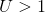 gives 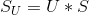
  - Down factor: 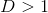 gives 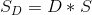
  - Assumption: 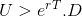
    - no arbitrage oppourtunities
- Let 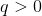 denote the probability of the stock going up

#### Replicating Portfolio - Binomial Model
- Portfolio construction: purchase  units of the underlying, b units invested in money market account
  - b earns the risk free rate
- Initial value of portfolio: 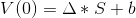
- At maturity: 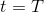
  - 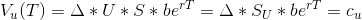
  - 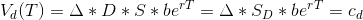

We can then derive the values for  and b:
- 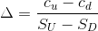
  - Just subtract both equations
  -  becomes similar to the hedging ratio
- 
  - Can use either equation, just use the relevant position

#### How to find the value of the option?
- The value of the portfolio V is equal to the value of the option c at any time, 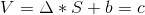
- 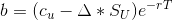
  - 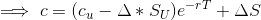
- Let 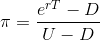
- Then, 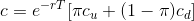

#### Risk neutral valuation of the principal
- Interpret  as probability
- As an expectation: 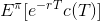

#### Example: Pricing a call option
- YBM's stock price is 100 today
- after one year
  - 
  - 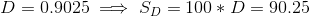
  - 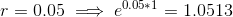
- 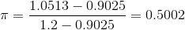
- With strike price 110
  - 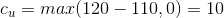
  - 
  - 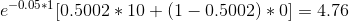

The expected return follows the risk-free rate if investors are risk neutral

We can add additional periods by adding intermediate layers

#### Two-Step Binomial Trees
- update state is always: , down is always 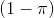
- Just multiply by the proper probabilty as you traverse through the tree
  - Number of nodes grows exponentially, too much work to do by hand
- Need a structure to allow for many periods, without exponential properties
  - **REcombining**: Note that `down, up` is the same as `up, down`
    - For this property we need 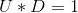
    - Then the number of nodes in each layer is linearlly proportional to the layer
      - 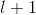
- Periods are always the same distance from eachother
  - 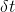 defines the length of each individual timestep
  - Total length is T
    - Sum of all periods: 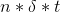

#### How to price option
1. Build the tree
2. Compute value of the derivative for each node in the second layer
  - Use the strike price and derivative type
  - Ex: for a put with strike price 52: 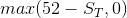
3. Work backwards computing the option values
  - Need 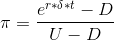
  - 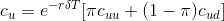
  - 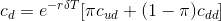
4. Then find C
  - Note that  doesn't change
  - 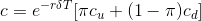

Then to compute: 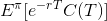 **(for european case)**
- C(T) can take on multiple values
- sum of the probabilities, just look at path in the tree
- **For american** have to work through the iterative approach
  - Can exercise at any point in time
  - The payoff is the max of present value (keep holding), or the intrinsic value
  - This has implications for the present value of the option, because of the possibility to exercise in the future

#### How to Choose U and D?
- 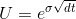
  -  is the volatility of the underlying stock's price
- 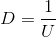

#### Increasing the number of steps
- A smaller time step gives a better approximation of the true
