# Lecture 3 - May 29, 2018

## Determination of Forward Prices (The Principals)

- Consumption assets: help for consumption
  - copper, oil
  - need the assets for your business
  - part of your costs
- investment assets: held purely for investment purposes
  - gold, silver

### Short Selling
- Selling securities that you do not own.
- You broker borrows the securities from another client, sells them in the market. You must eventually buy the securities so they can be replaced in the account of the client.
- You must pay dividends and other benefits to the owner of the security

#### Example
- short 100 shares, current price per share is 100, close short position in 3 months when the price is 90. Pay a dividend of 3 per share.
- profit for short
  - buy 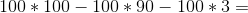,
- loss for long

### A cost-of-carry approach

cash-and-carry argument.
1. buy the underlying commodity in the spot market with borrowed cash, hold it until forward maturity date. carry to the future.
2. pay various costs of carry (carrying charges)
3. Hash the same payoff at maturity as the forward. They must be equal or else arbitrage would occur.

arbitrage:
- If Walmart sells an item for 5 and Costco for 3
- Borrow money and pay 0.25 cents interest
- go sit outside of Walmart, sell for 4.
- 0.75 cent profit without any risk for yourself.

law of one price:
- if you have 2 assets with the same cashflows, they have to be worth the same.
- If not, then there is an arbitrage oppourtunity.

#### Assumptions
- work in a frictionless market: no bid and ask prices, no credit risk.

#### Example
- january 1
- 1 year forward contract on YBM stock.
- No cashflows today because the forward price is the fair price.
  - Costs nothing today
  - maturity: stock worth S(T), buy them for F dollars.

##### Alternative 1
- Buy YBM and carry it into the future (i.e. buy it directly, no future)
- at time 0, pay 100
  - borrow 100, pay back the loan at maturity (in 1 year)
- pay back loan 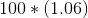
- This has to be the same as the future oppourtunity, otherwise there is an arbitrage oppourtunity.
- Has to be the case that 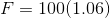
  - Here we only have a borrowing cost, realistically you would have additional costs for assets (storage). But the value would become a function of those costs.

In this example, any gains would happen at the end

##### Alternative 2
- borrow the present value of the future (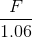), then short sell the asset.
- Cashflow at time 0: 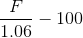, if it's not zero there's an arbitrage oppourtunity
  - 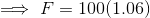

### Forward vs. Future Price
- When maturity and asset price are the same, forward and future price are the same
- slightly different when interest rates are different.
  - high positive correlation: future prices higher than forward price
  - high negative correlation: future prices lower than forward price.

### Forward Price
- 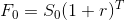
  - T years
  - r interest rate

continuous compounding: 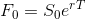

### How to exploit an arbitrage oppourtunity
- Forward price greater than true, establish a short position and long position.

Action now:
1. enter into forward contract, sell in 3 months for 43
2. borrow 40 at 5% for 3 months
3. buy the asset

Action in 3 months:
1. Sell asset for 43
2. use 40.50 to repay the loan.

Profit of 2.50 is realized in 3 months.

### excercise 1

> An asset that does not pay any cash flow is currently trading at $40. An errant trader
wants to trade a forward on that asset for $39. The maturity of the contract is 0.25.
Assume that the interest rate is 5% for all maturities.

- Is there an arbitrage opportunity? What would be the profit?
  - Yes, there is.
  - The price of the forward is lower than the current spot price.
- Describe the steps that you have to follow in order to secure this opportunity.
  - Short the bond, future value is: 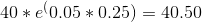
  - purchase the forward today for 39, using the proceeds
  - in 3 months buy the asset, closing out your short position.

part 2

> What is the effect of increasing interest rates on forward prices?
- Price increases, higher cost of borrowing higher price.

> Are forward prices increasing or decreasing with maturity? Why?
- Increasing. Projecting further into the future.

> Are forward prices increasing or decreasing with spot prices?
- Increasing.

For this example, there is no benefit other than the price.

### When an Investment provides a known dollar income

- I is the present value of the income during the life of the forward contract (i.e. up to the maturity of the contract).

#### Example

| r | T |
|-|-|
| 3% | 4 |
| 4% | 9 |

- 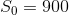
- 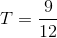
- $$I = 40 e^{-3% * \frac{4}{12}}
- 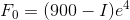

In this example, there's only one payment prior to maturity.

Suppose we are quoted 910, overpriced. Short sell this contract, use the proceeds to make a long position (replicating the forward)

now
1. enter into forward to sell asset in 9 months (short)
2. borrow 900: 39.6 for 4 months, 860.4 for 0 months
  - Match the loan payments to the payments of the underlying asset
3. Buy one unit of the asset

in 4 months
1. recieve 40 of income from asset
2. replay first lean

in 9 months
1. sell asset for 910
2. use 886.6 to replay second loan

If quoted lower, short the bond

action now
1. enter into forward contract, buy
2. short 1 unit of asset to realize 900
3. invest 39.6 for 4 months, 860.4 for 9 months

4 months
1. recieve 40 from investment
2. pay income

9 months
1. recieve 886
2. buy asset for 870
3. close short position.

### When an investment asset provides a known yield
- 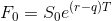
- q is the average yield during the life of the contract (assume continuous compounding)
- Note: 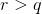 prices increase for longer dates, costly to hold the asset for longer time.
- Note: 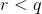 price decrease for longer dates many benefits to hold the asset

#### Index Arbitrage:
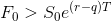
- buy the stock underlying the asset and sells the futures
- But this often means you need to replicate the entire portfolio, need low transaction costs

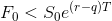
- buy futures and short / sell the underlying asset

### Futures and Forwards on Currencies
- forward exchange rate

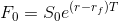
-  is the forign risk-free exchange rate.
- Always take the perspective of the US investor

#### Example
- A
  - 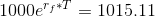
  - $$1000 * F_0 * e^{r_f * T} = 812s$
  - 808
- B
  - 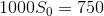
  - 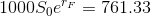

Use the cheaper one as funding, invest in the more expensive one.

### Futures on Commodities: Storage is Negative Income

we have to pay extra in order to store the underlying asset.

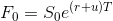
- u Storage value per unit of time
- ex. 5% every year

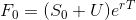
- U is present value of storage costs
- U is 2 per year

#### Example: Goal future price
- How do storage costs effect the arbirage oppourtunity.
- futures price too high
  - borrow money to buy gold
  - short the future
  - you have to pay storage costs
- future price too low
  - short gold
  - enter the future contract for delievery
  - don't have to pay storage costs, don't have to hold the formula for a year

### Cost of Carry
- c is the cost of carry (storage costs + interest - income earned)
- investment asset: 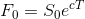
- consumption asset: 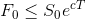
  - 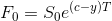

### Markig-to-market a forward contract
- forward contract woth 0 when it's negotiated
- later could be positive or negiatve
- value of long forward contract: 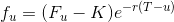
- value of short forward contract: 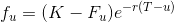
- Intermediate cashflow: 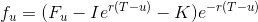

### Exercise 2

Part 1

Fair value of the contract:
- 51 dollars

Suppose a trader is quoting for 50 dollars (underpriced), how to exploit?
- enter into the futures contract for 50 dollars
- short sell the asset, invest the present values of income for 3, 6, and 9 months. Invest the remainder for 10 months
- Pay the dividends as required

