# Lecture 4 - June 5, 2018

## Technical Test
- next week
- multiple choice
- chapter 2, 3, 5
- go through the excersices (in the book and given)

Last Weeks Quiz
- answer was d: 75,648
- (15 + 10 * 0.24)exp(10% * 10/12) = 18.91 for one contract
- Multiply the price per contract by 2

## Forwarding Prices

### Futures Prices and Expected Future Spot Price
- let k be the expected return required by the investor
  - can't use the risk free directly, need to incorporate the expected return
- 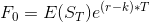
  - 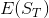: Expected spot price at the time of maturity
- 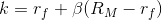

- If there is systematic risk: 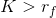
  - Future price will be higher, prices are going to converge from above.
  - comphensation related to the systematic risk
- 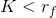
  - futures prices selling at a discount
  - the asset has negative systematic risk.

Positive systematic risk: stocks
Negative systematic risk: gold

## Hedging

- Futures are typically traded to preexisting hedge risk in some line of business
- man selling sunglasses and ubrella
  - when sunny, sell sunglasses
  - when raining, sell umbrellas
  - prepared for any state of the world
  - **natural hedge**: Inverse behaviour of assets
- hedging can reduce risk in fluctuations
  - example: farm wants to lock in the price, lock into a contract to mitigate changes in price.

### Benefits of corporate hedging
1. hedging locks in a future price
  - example: farmers locking stable prices, plan production and marketing accordingly
2. hedging premits forward pricing of products
  - example: airlines hedge fuels prices
    - want to offer vacations, they know the cost of fuel, can negotiate with hotels, can offer a price knowing their margins

### Perfect Hedge

This is the optimal scenario, hard to get in practice.
- have a contract which provides you with a contract that exacly covers the loss (eliminates spot-price risk). Best case scenario.

There are requirements that effect the optimality:
- the futures contract is written on the commodity being hedged.
- the contract matures when the hedger is planning to lift the hedge
- the size and other characteristics of the futures contract fit the hedger's need.

**Imperfect / Cross-hedges** occur when these conditions are not met

### Long Hedges
- When you are going to purchase something in the future and you want to lock in the price.
- You want protection in case prices rise.
- finance the purchase with gains from the future contract.
- Suppose your in vancouver, the future is in Montreal. Instead close out the position on maturity (i.e. don't settle) and buy from the local manufacturer.

### Short Hedge
- Use when you need to sell an asset, afraid of prices going down

### Basis Risk

Dealing with imperfections

- basis: the difference between spot and futures prices
- basis = spot price of hedged asset - futures price of contract used.
- basis risk arises because of the uncertainty about the basis when the hedge is closed out.
  - suppose you can't find a future that matures when you want

- : futures price at the time hedge is set up
- : futures price at the asset is purchased
- : asset price at the time of purchase
- : basis at time of purchase
- Cost of asset 
- Gain/loss on futures: 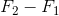
- Net amount paid: 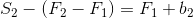
  - Note: In the case of a perfect hedge: 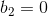

if you don't hedge, then you pay . If you hedge, you gain / loss factors in.

As the basis widens ie 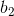 increases: you end up paying more for the asset.

### Choice of Contract
- choose a delivery month that is as close as possible to, but later than, the end of the life of the hedge.
- when no ftures contract on the asset, choose a contract where the future price is highly correlated
  - Bitcoin and Etherum
- 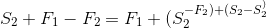

#### Cross Hedging - Minimum variance hedge ratio
- compute deltas on the 2 assets over time
- Bitcoin and Ethereum
- do simple regression: 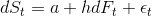
  - also compute , how effective is the hedging we are going to use. Want highest possible 
- 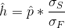
  - sigmas are std deviation.
- optimal number of contracts : 
- Market value of the quantity: 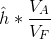

### Hedging using index futures
- we want to get rid of systematic risk
- one possibility, sell of the portfolio, buy back later, but high transaction fees
- number of contacts that should be shorted is: 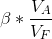
  - 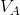 is the value of the portfolio
  - 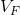 is the current value of futures: price times
-  as the systematic risk has been eliminated.

### Changing beta of a portfolio
-  short position of 
-  long position of 

Examples:
1. 6.82, short
2. 4.5, long

### Why Hedge Equity Returns
- you may want to exit the market, but avoid all of the transaction fees

### Stack and Roll
- roll futures contracts forward
- as maturity approaches, close position, get new futures
