# Lecture 5 - June 12, 2018

## Interest Rate Derivatives

### Types of Rates
- **Treasury Rate**: rates on instruments issed by governments in it's own currency
  - risk free for good economies (US, Canada)
- **ICE LIBOR**: Rate of interest by which a AA bank can borrow from another bank, unsecured
  - LIBOR: ask all banks, remove top and bottom quantile, average the rest
    - every day rates for different maturities and currencies are posted
  - changed the entity in charge of computing the rate, result of 2008 scandels
- **Overnight Rate**
  - unsecured interbank rate of interest
  - central bank regulates the flow of money in an economy
  - Allows the bank to maintain reserves at the central bank
  - excess reserves are given to other banks, recieve interest.
- **Repo Rate**
  - related to short selling, need to borrow and pay back
  - sell a security for X, buy it back in the future for some higher price Y.
- **Swap Rate**
  - LIBOR is swapped for a fixed rate
  - remove variability across time
- **Overnight Index Swap(OIS) Rate**
  - Overnight rates over some period is exchanged for the geometric average 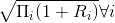

### Risk Free Rate

considered to be artifically low:
- banks aren't required to hold capital for Treasury Investments
- high demands for bonds
- Favourable tax treatment, increasing the demand.

OIS now used as a proxy for risk-free rates

**Rate Spread**: same maturities, look at the difference
- TED Spread: LIBOR against the treasury rate
  - during the financial crisis the spread dramatically increased.
  - acts as a proxy for risk in the financial market

### Bootstrap

How to extract interest rates from quotes.

Suppose you purchase a 3 month T-bond
- buy for 97.5, in 3 months recieve 100
- There's an implicit rate here

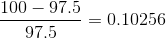 with quarterly compounding
- from here, can change the compounding period (continuous, 6 months, ...)
- 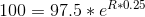 - solve for R
- For discounting, we will use continuous compounding

Always match the correct rate to the correct maturity period

What happens if you have 0.75?
- Interpolate between the neighbouring values
- average the previous and following period
- **For this class, we will always have the values we need**

If a security pays dividends
- Match the interest rate compounding period to the payment period
- just compute the present values
- Iterative process to compute the rates for each period

### Forward Rates
- When the market quotes zero-rates, they allow us to extract forward rates

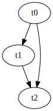

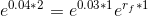 - Solve for 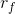
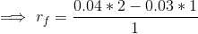 (ln)

Forward rate between 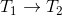
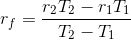

### Forward Rate Agreement (FRA)

Lock in an interest rate for some period of time.
- Over the counter agreement
- borrowing or lending
- Payoff at maturity: 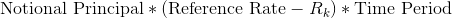
  - long: pay the fixed rate,  is the borrowing rate.
  - short: Recieve the fixed rate, 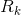 is the lending rate

#### Example
- 5x8:
  - In 5 months you will know the rate
  - In 8 months you will have to pay

