# Lecture 6 - June 19, 2018

Recall that a forward rate agreement allows us to lock in an interest rate for the future

### Eurodollar Futures
- underlying is always a 3 month LIBOR rate
  - **always**, no matter the maturity
- If you are afraid of interest rates going up, what position will you take?
  - short
  - The price is inversely correlated with the interest rate
  - Interest rate going up implies the price is going down.

#### Example (Slide 19)
- 11 basis point change between Nov 1 and 2
- 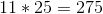
- From november 1 to 2 the implied interest rate decreased
  - note that the price went up
- From november 2 to 3, the quote dropped, interest rates went up

#### Implicit Rate in an ED Future Quote
- Note that the example is working with percentages (i.e. why the 10,000 instead of 1,000,000)
- 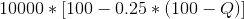
  - November 1: 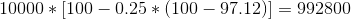
  - November 2: 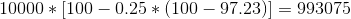
  - 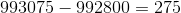
- Notice that this result is exactly the same as the previous calculation.

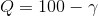
- Quote price is linear in the interest rate ()

### Exercise on ED-Futures
- 50 basis points (bps) is the spread, what has to be paid on top of the LIBOR rate (which is only available to banks)

a. What is the rate that we will lock in
  - 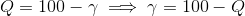
  - Disney can lock in 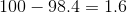
  - Therefore the rate it pays is 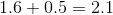
b. how to profit if interest rates go up?
  - take a short position
  - You will be hedging the possibility of interest rates going up.
  - Take a short position of 50 contracts
c. If interest rates were 1.3 what is the quote?
  - 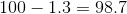
d. The futures contract is settled in September, interest rates are paid 3 months later.

## Conventions

### Day Count

Defines the time to which the interest rate applies. The period of time used to calculate accrued interest (relevant when it is bought or sold).

- Treasury Bonds: Actual/Actual
- Corporate Bonds: 30/360
- Money Markey Instruments: Actual/30

**Note**: When you change the country, these conventions will change.

#### Example: Treasury Bond

- Coupon: 8%
- Payment days: March and September 1
- How much interest earned between March 1 and July 3?
  - 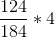
  - Number of days between march and july / march and september

#### Example: Corporate Bond

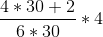

#### Example: commercial paper

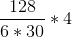

Dirty price = quoted price + accrued interest
- Cash price == dirty price, the price that you actually pay

### Treasury Bond futures
- underlying asset: is any government bond with maturity between 15 to 25 years on the first day of the delivery month
- Quotes are in dollars and 32-nds of a dollar per 100 dollar face value

cash price recieved by short position = most recent settlement price * Conversion factor + accrued interest
- Conversion factor accounts for the fact that different bonds will have different interest
- Accrued interest is for the underlying bond

#### Example: Cash recieved by short position
- settlement price: 90
- conversion factor of the bond delivered: 1.38
- Accured interest of bond: 3
- 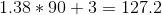

#### Conversion Factor
- Semi annual compounding
- typically from CNE, Bloomburg, etc

#### Choosing the Cheapest to deliver bond
- Delivery cost = cost to purchase - cash price recieved by party with the short position
- Have a pool of available bonds, compute the delievery cost of each, choose the one with the lowest delivery cost
  - that's the one to choose if your taking the short position

#### Steps to compute treasury bond futures price quotes
- Know the cheapest to deliever bond

1. Obtain cash price of the bond
2. Compute forward price of that bond 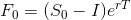
3. Subtract the accrued interest from the future price, to obtain the quote price
4. Divide by the conversion factor

Basically the steps in reverse.

##### Example (Slide 13)

1. Obtain the cash price for the underlying bond
  - Quoted price: 115
  - Accrued interest: 
  - Cash price: 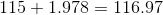
2. Compute Future price
  - 
    - Present value of all coupons recieved
  - 
3. Compute Clean Future Price
  - 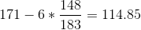
4. Remove the conversion factor
  - 

## Swaps
- Swap is an arrangement to exchange cash flows at specified future times according to certain rules.
- floating cash flows vs. fixed
- Payments sent/recieved depend on the LIBOR rate, set on the specified day.

### Uses of an Interest Rate swap
- Converting a liability from:
  - floating rate -> fixed rate
    - recieving a variable rate, want to get a fixed rate
  - fixed rate -> floating rate
    - Currently paying LIBOR, want to pay a variable rate instead

- Converting an investment from:
  - floating -> fixed
    - recieving a variable rate, exchange for fixed LIBOR with a spread
  - fixed -> floating
    - recieve LIBOR (spread), recieve a variable rate

### The Comparative Advantage Argument
- AAACorp wants to borrow floating
  - better credit rating, has a lower cost
- BBBCorp wants to borrow fixed
  - lower credit rating than AAA

AAA can borrow at the fixed rate, start a swap with BBB.
- Pay LIBOR and recieve 4.35
- BBBCorp borrow at floating: LIBOR + 0.6

This is a better deal for both companies than just using the rates alone:
- AAACorp ends up paying: LIBOR - 0.35
  - Notice that LIBOR - 0.1 is a higher rate
- BBBCorp ends up: 4.95
  - The alternative fixed rate is 5.20

In reality, this is difficult for companies to do alone. They don't know eachother exist
- Instead, introduce an investment bank, who sets up indepentent swaps with each company.
- The investment bank introduces a spread between the two rates, their fee to provide the service.

### Valuation of an interest rate swap
- initially interest rate swaps are worth close to 0
  - Present values of fixed and variable are the same at the beginning

Recall that this is just a generalization of Forward Rate Agreements
- do so as a portfolio of Forward rate agreements

1. Calculate LIBOR forward rates
2. Calculate the swap cash flows that will occur if LIBOR forward rates are realized
3. discount the swap cash flows at OIS rate
  - Present values

#### Example: Evaluating an Old Swap
- 3 month: 2.8 -> 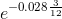
- 9 month: 3.2:-> 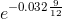
- 15 month: 3.4:-> 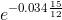

Fixed cash flow rate: 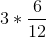

### Pricing A Swap

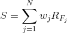
- 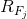: LIBOR forward rate associated with period 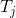
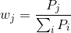
- 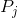 present value of 1 dollar accrued for period 

#### Bootstrapping Forward rates example
- We know everything for the first 3 periods
- final period don't know the forward rate, easy to solve for it
