# Lecture 7 - June 26, 2018

## Excercise solution

This is with annual compounding:
- 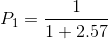
- 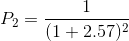

- Current 1 year LIBOR: 3%
- LIBOR forward 1 to 2 year period: 3.2%
- 3 year (annual payments): 3.2%
a. Find the LIBOR forward rate for 2-3 year period
  - 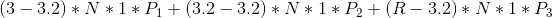
  - Just solve for 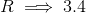 (recall that we can compute each 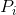)
b. Value a 3 year swap, 4% recieved, LIBOR paid on principal of $100 million
  - Take the cash flows and forward rates
  - Note that 4% is the 1 year rate
  - 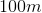 is 100 million
  - We know the forward rates for (1-2, 2-3), use the swap LIBOR rate from part a (3.4)
  - 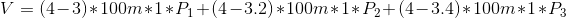
c. If the 3-4 forward rate is 4.1%, what should be the swap rate for a 4-year swap contract?
  - Compute Present values for each, weighted average of the rates
  - 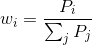
  - solve for the swap rate
  - 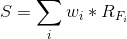

### Question 3

Airbus
- borrow at 11% fixed rate
- or: LIBOR + 1 floating rate

Bombardier
- borrow at 10% fixed rate
- or: LIBOR + 3% floating rate

How can you bring both companies together in an interest swap that would make both better off:
- Note: Although Airbus has a better credit rating than Bombardier, Bombardier has a better fixed rate because it is supported by the federal government.

Solution
- Airbus goes for the floating rate, enter into a swap rate with Bombardier, who uses their fixed rate
- 3% that can be distributed between the companies (assume equal parts, i.e. benefit both by 1.5%)
- Airbus
  - recieve LIBOR + 0.5%, pay 9% to Bombardier. 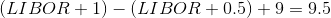 implies better off their fixed rate by 1.5%
  - Borrow at fixed rate, pay LIBOR + 0.5%, recieve a fixed rate of 9%. 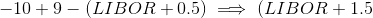

## Options: General Aspects
- Rights to perform action at a price

### Types
Suppose  is the strike price

- **call**: option to buy
  - value at which you can buy is called the **strike price**
  - Decision to exercise is dependent on the price of the underlying (don't want to loose out when you can just buy)
  - Payoff at maturity (Euro): 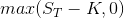
- **put**: option to sell
  - Payoff at maturity (Euro): 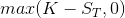
- **European**: Can only excerised at the end of it's life
- **American**: Can be excerised at any time, until maturity

Options are traded on the market
- The price is related to their payout

### Long call
- Expect the market to go up
- In practice, you pay to own the option
- breakeven point: Underlying price = Strike price + option price
- make money when 

### Short call
- expect the market goes down
- Very risky, can have unlimited losses
- make money when $$underlying < strike price - option price

### Long Put
- expect the market goes down

### Short Put
- Expect the market to go up

### Specifics of exchange traded options
- Expiration date: T
- Strike Price: K
- option class: call or put
- Lot size is typically for 100 shares

**Moneyness**
- At the money: 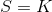
- In the money: Make money
  - call 
  - put  
- Out of the money: Loose money
  - call 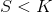
  - put 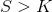

**Option Class**: call or put
**Option series**: Specific contract over time
**Intrinsic VAlue**: payoff from an immediate exercise, always use the current value of the underlying
- Call: 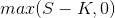
- Put: 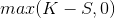

**Time Value**: Different possible values at maturity
  - intrinsic and time value converge as time approaches maturity

### Dividends and stock splits
- recall that trading an option on an exchange is in bundles of 100
- If there's a stock split, your contract must change as a function of this split
- Suppose there is an n for m stock split
  - The value of the position won't change
  - the number of shares changes
  - 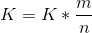 (decreases)
  - Number of shares is: 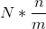 (increases)
- For dividends
  - If it's paid in dollars, no change
  - if it's stocks, then it must be changed (as the amount of stock is effected)
    - 5% stock dividend => 21-for-20 split: option to buy 105 shares at $19.05

### Market Makers
- party that is behind the bid and ask prices

#### Margin

In the case of short selling options, need margin to cover potential losses (which can be very large)

when a naked option is written, margin is the larger of:
- A total of 100% of proceeds of sale, plus 20% of the underlying share price less the amount out of the money
- 100% of proceeds of the sale plus:
  - call: 10% of underlying share price
  - put: exercise price
- **Example:** 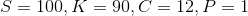
  - Note that we're in the money
  - 12 + 0.2(100 - 0) = 12 + 20 = 32
  - 12 + 0.1(100) = 22

### How firms can hedge
- compared to a futures strategy, the option strategy only protects in the cases where losses can occur

| | futures strategy | option strategy |
|-|-|-|
| intends to buy; concerned about price increase | long futures | purchase call option |
| intends to sell; concerned about price decrease | short futures | purchase put option |

## Test 2
- 30% is multiple choice
- 70% is calculations
  - show work
- See online
