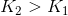
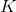
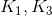
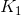

# Lecture 8 - July 3, 2018

## Strategies with options

- Stock plus option
- 2+ of the same type (a spread)
- 2+ of different types (a combination)
- Bond plus option to create principal protected note

### a: Covered Call
- Short call
- Own the underlying stock

### b:
- long call
- short underlying
- equivalent to a long put
- why not just buy the put?
  - you are typically trading against the market maker, they will probably put a larger spread on it.
  - by creating a synthetic put, you can be better off.

### c:
- long put
- own the underlying stock
- creates a synthetic long call position

### d:
- short underlying
- short put
- replicate a short call

### Bull Spread using calls
- Bullish on the underlying stock
- But don't want to risk in case things go bad
- short call, strike price 
- Use funds to buy long call with strike price: 
- Note: 
- Add the functions together
- Can add together the functions
- Basically produces 3 regions

### Bull Spread using Puts
- Basically the same as above

### Bear Spread using Puts
- Expect the underlying stock value to go down
- If the value drops too low then you could be better off with the long put, but everywhere else you're better off

### Bear Spead using calls
- Sell call with 
- Buy call with 

### A Straddle Combination
- Buy a call with a strike price 
- Buy a put with a strike price 
- In this strategy, you realize profits when the underlying goes extremely up or down
- Take advantage of the volatility of the underlying
- Better off as the stock moves away from the strike price
- **Note** An inverse straddle position is very risky, instead...

### Butterfly spread using calls
- Use 2 long calls 
- 2 Short calls with strike price 
- Use in the cases of Merger and Acquisition
  - The target typically goes up
  - Currently trading at , expect it to jump to 
  - since you're trading on rumors, you want to limit the potential losses

Can also build it using puts
- Really depends on the strike prices

### Strip and strap
- **Strip**: More profits when price goes down
- **Strap**: More profits when the price goes up

### Strangle Combination
- Straddle with two different strike prices
- Don't have much money
- Need a large move to start getting profits
- Try to limit the range in which the stock price will go

### Calendar Spread using calls
- Combine different maturities, match the strike prices

## Principal Protected Note

