# Lecture 9 - July 10, 2018

## Excercise Strategies - Question 3
Short Strangle
- underlying price needs to stay close to the strike price
- betting against high volatility
- max loss: infinite. If the underlying price keeps rising
- Breakeven points: 1799-5 and 1949+5
  - Profits in between

## Option Properties

### Effects of variables on Option Price
- slide 2: First 2 columns -> European Options, Last 2 -> American
  - Both c->call, p->put

- **Current Stock Price:** 
  - Draw the graphs
  - notice that as the price increase, for calls: move closer to being in the money, puts: moves farther away
  - Same for american and euro
- **Strike Price**: 
  - again: draw the graphs
  - For calls: Notice that a lower strike prices increases your chances of being in the money
    - Negative correlation on price
  - For puts: Lower strike price decreases your chances of being in the money
    - positive correlation on price
  - Same for american and euro
- **Maturity**: 
  - Recall the difference between American and European options, American: can excercise at any point.
  - Euro: can't do anything until maturity
    - Therefore maturity has no effect on the price of an option
  - American: Can excercise at anypoint during the lifecycle of the option
    - Have an increased oppourtunity of observing a profitable scenario.
    - American options are higher priced
  - **American** options can never be priced less than an equivalent **European** bond
- **Volatility**: 
  - Call/Put and Euro/American doesn't matter
  - probability of possible values that the underlying price could take on
  - lower volatility: (assuming a normal distribution) the expected value is much clearer, lower standard deviation, lower odds of being in the money
  - higher: higher standard deviation, potentially increasing your chances of being in the money
- **Risk Free Rate** 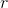
  - Examine CAPM: $$E[r_i] = r + \beta(E[r_n] - r)
  - With a higher risk free rate, faster rate of appreciation, end up in the money sooner.
  - With a call (euro/american) increases price
  - With a put: decreases prices
- **Dividend Payments**: 
  - Price goes down when a dividend is payed
    - we are removing money from the company
  - Call: Negative relation
    - decreasing the value of the underlying, decreasing likelihood of being in the money
  - Puts: Positive relation

#### Replication with Options

We want to find a way to price options

Recall that pricing forwards is a linear relationship
- Via the no-arbitrage principal

With options, need additional information to determine the price
- How the stock price will evolve

##### Put-Call Parity (PCP)
A combination of options and the underlying can produce a call or put option

- combination of a short call, long underlying
- combination of call + underlying
  - short put
- long put + long call
  - long call

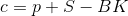
- Long call = Long put + long stock - short bonds
- 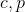 are today's price of Euro calls and puts
  - Strike price K, expiration T
- 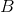: today's price of zero-coupon bond 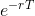
- 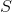: Underlying price today

If this equality does not hold, there is an arbitrage oppoutunity to be exploited

###### Establishing PCP by Payoff Diagram
- Long put: Strike Price 20
- fund the purchase of a long call
- funded transaction: Not you're money
  - that's why the minimum payoff is 
- Combined effect: a long call
  - "It's not really a call"
  - a real call would have minimum payoff of 0
- To get a true call
  - Need to be worth 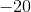 no matter the value of the underlying
  - short sell 20 zero-coupon bonds
- If this porfolio has a different value to an actual call, then there is an arbitrage oppourtunity.

###### Slide 11 Example:
- IBM Stock: $22.50 today (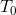)
- options have Strike price of $20, mature in 6 months
- put price is $0.50
- 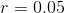 per year
- 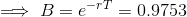
- no dividends
- 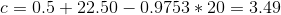
- real call price: $4
- Short real, long synthetic
- Profit of 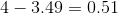
- Columns in the table on slide 13 is comparing Stock price to the strike price

IF the call price is $3
- The we need to create a synthetic short call
- The call is underpriced: Profit is 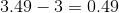
- short put, short stock, buy bonds
  - as always, short case is just the equation * -1

## Binomial Tree for Valuing Options
- Build a binary tree over time, outcomes of events are branches
  - each level in the tree is a period
  - Some probability of taking each branch, i.e. the world ending up in some state
- "State of the world up" vs. "State of the world down"
  - do we win or loose
- 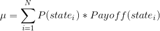
- 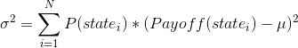

### Example: Euro Call Pricing

Asset A:
- Current price: 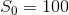
- In one year
  - go upto $120 (suppose probability 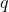)
  - go down to $90.25

Asset B:
- Dollar invested in money market account grows to $1.0513

Consider a Euro call option, 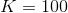, maturity in 1 year
- 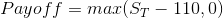
  - Upside: 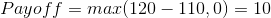
  - Downside: 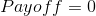

How much to pay?
- Come up with a portfolio that looks like the call options (i.e. that has the same payoff)
  - Build it using asset A and B

- Let  be the number of underlying units purchased
- Let  be the number of units put into the money market account
- 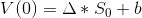
  - Want 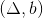 such that payoff at time 1 matches the call
  - upside: 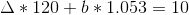
  - downside: 
  - 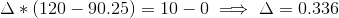
  - Solve for b, 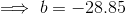

To construct the portfolio:
- Time 0: Need to buy  units of underlying, borrow  dollars
  - 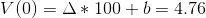
  - This price must be the same as the price of the call, otherwise there is an arbirage opportunity

Arbitrage:
- suppose a trader quotes $7 for the call
  - sell the overpriced traded call for $7
  - construct the synthetic call for $4.76 (as above)
  - immediate profit of 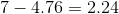
- suppose the quote is $3
  - buy the call for $3
  - short the portfolio, rebuild the portfolio with reversed positions

**Euro put Example**

Payoff:
- upside: max(110 - 120, 0) = 0
- Downside: max(110 - 90.25, 0) = 19.75

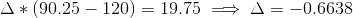
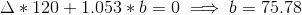
