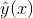
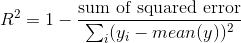

# Lecture 1 - January 5, 2018

## Types of Analytics
Categorize by the goal, methods used, etc.

### Exploratory Analytics (Unsupervised Learning)
- unlabelled data
- try to group and cluster the data
- find patterns
- "What segments of customers do I have?"

### Descriptive Analysis
- Prep and analyze historical data
- identifies patterns
- "What is the risk of a particaular asset?"

### Explanatory analytics
- Establish causation
- "What determines the price of a house?"
  - number of bedrooms, bathrooms
  - square footage
  - location
  - try to figure out what causes that price => What happens if a renovate the bathroom?

### Predictive Analytics (Supervised Learning)
- Predict future events / unknown characteristics
- Don't care about modifications
- Machine learning
  - labelled data
- "How much will this house sell for?"

### Prescriptive Analytics
- Optimization problems
- "What is the best investment portfolio?"

## Regression Analysis

Utimately want to answer "how is Y related to X?"
- Y dependant
-  - n independent variables
- Linear relationship

### Descriptive POV
Simply quantifying a relationship, describe it.

### Explanatory POV
Try to support some causal claim
- Increase housing price by 10% -> Increase in square footage

### Predictive POV
Use "quantified relationships" to predict new values of Y, given some X values.
- Forecasting
- Given some information about a house, predict it's price.

## Linear regression

The betas are unknown and need to be estimated from the data.

### Estimation of Params
Let  be our estimate for the true function.
To find the best estimation for the samples, optimize the squared error: 

### Example

> Does doing homework influence exam grade?

- Exam grade is dependent
- Independent are number of homeworks completed
- **Note:** There could be missing information/variables that represent the true relationship (ex. hours studied, attendence)

This could produce 

## Multiple Linear Regression
Regression model with  independent variables. Each indepedent variable influences the relationship in some proportion

## Assessing a Regression Model
Least squares will produce a regression line *regardless* if there is actually a linear relationship in the data.

### Model Error
- Residuals: Error between the models and the sample data.

### Coefficent of Determination
- Measures goodness of fit
- Adding independent variables **always** increases R^2
- Model error vs risidual error

### Hypothesis Testing (p-value)
- Null hypothesis: 
- lower p-values are better

## Assumptions
- Y is linearly related to X
- Relevant X's are used
