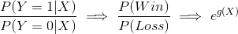

# Lecture 2 - January 12, 2018

## Logistic Regression

The goal is to find optimal params  to optimize log likelihood

### Explanetory context
Example: What is causing someone to where a jacket
- Interperet results as a probability.
- 
- **Parametric assumption**: Follow sigmoid shape, low-high or high-low

### Odds Ratio

Example: The horse has  odds of winning the race, probability of winning is 5/7.

### Linear Log odds ratio

## Pilgrim Bank Case A

### Industry
- Retail banking: 2001
  - Dot-com era, pre crash, pre 911
  - Internet big new thing, new oppourtunities
- B2C, lots of small consumers
- Not always clear what drives profits
  - Depends on amount of fees paid
  - Services used
- Customers are pretty loyal, not trivial to switch banks

- Alan Green
  - analyst
  - online banking group
- Bank isn't sure about which business model to use for their online banking channel
  - should they charge a fee for online banking?
  - analysis should provide evidence to support some claim

- Intuitively:
  - reasons for no
    - may cause customers to leave for another bank
    - cheaper for the bank, don't have to use physical banks, employees
  - reasons for yes
    - more profit for online users
    - Not many people have computers yet

### Questions to guide analysis
- Is being online associated with higher profits?
  - Descriptive question
- Does the online channel cause higher profilts?
  - explanatory question

What is the true relationship?

or maybe?

There could be some other variable(s) that effect both online and profits, for example:

## How to deal with missing data
1. Delete rows with missing values
2. replace missing with default value
  - 0
  - mean
3. Use default values and add an extra column with a missing data flag
4. Imputation: build a model for the missing values, predict the values to fill missing.

## Prediction
- Supervised learning
- **Goal:** Given a labelled data set, predict new label values for future samples.
- Predict continuous values or categorical
- p-values don't neccessarily matter: as long as it's encapsulated in the model then it's ok.
-  is important: it is the error/accuracy measure

## Classification
- Prediction for categorical variables

