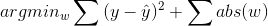
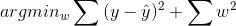

# Lecture 4 - January 26, 2018

## Last Class
- Different types of errors
  - False Negatives: Classify as negative, get it wrong
  - False Positives: Classify as positive, get it wrong
- diminishing returns on thresholds

### Decision Trees
- `cp` param sets the tolerance for the Information Gain.
- How much is needed in order to fork a new branch.

### Over / Under Fitting
- Overfit: Models can't generalize to new data.
   - Training accuracy much higher then testing.
   - Model is too complex
- Underfit: Not trained enough, not accurate.
  - Not specific enough, model is too simple.
  - Model not capable: i.e. trying to use a linear model on data that is non-linear.

## Neural Networks

Easy to overfit

### Regularization
- Use embedding methods
- Minimize the error and include a complexity penalty

#### L1 regularization

#### L2 regularization

### Deep Learning
- Many hidden layers
- Capable of more complex tasks
- Need a large dataset

### Financial Forecasting
- Data: several years of history of exchange rates

#### What are we trying to predict?
- Price at time t, given history of past timesteps

#### Regression Problem
- We're trying to predict a price, a continuous value

#### What features do we have?
- Past price data (previous time steps)
- competitors
- other market factors

### Quiz 4

- L1 - 0.001:
  - training loss: 0.347
  - test loss: 0.362
- L1 - 0.003 (some weights stronger, many low)
  - training loss: 0.365
  - test loss: 0.349
- L1 - 0.1 (all weights low, didn't learn much)
  - training loss: 0.464
  - test loss: 0.455
- L2 - 0.01 (Good distribution)
  - training loss: 0.365
  - test loss: 0.35

#### Q11
I found that there were diminishing returns as L1 rate increased. As we applied a larger penalty the model stopped overfitting and progressed to not learning anything (under fitting).

#### Q12
I found that using either L1 or L2 regularization with a low regularization rate helped to mitigate overfitting and produced similar results, with L2 producing slightly better results on the testing data. Depending on the particular problem choosing one of the approaches may be more beneficial.
