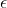

# Clustering
- unsupervised
- How similar are the items inside of each cluster?
- Sillhouette data
  - Postitive measure: in the cluster
  - Negative: More similar to items outside of the cluster

## Hierarchical Clustering
1. init cluster to individual samples
2. calculate cluster distance
3. merge two closest cluster
4. Repeat

This results in a tree structure, the structure can be cut at various depths in order to generate the appropriate amount of clusters.
This process builds the tree from the bottom-up.

### Advantages
- Less sensitive to model inputs
- no random starting points

### Disadvantage
- optimal tree is expensive to create
- heuristic algoriths are sensitive to changes in data

## Density Based Clustering
- Density based spatial clustering of applications with noise
- : describes radius around point to define a dense region
- : Number of samples in the region to be dense
- Optimize for density rather than proximity of clusters

### Advantages
- Works well on irregular shapes

### Disadvantages

## Scaling (magnitude)
- variables with large magnitude contribute more to the distance between samples
- If data cannot be meaningfully compared, scale the variable into some range .
  - **z-scaling**: Center around 0
  - **0, 1 scalaing**: Squash into 

