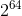
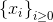
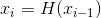
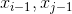
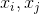
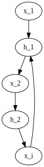
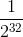

# Lecture 10 - January 24, 2018

## Hash functions

### Recall: 3 Cryptographic requirements
- preimage resistance
  - Given a hash, find any input with that hash.
  - **One Way Hash Function (OWHF)**
- second preimage resistance
  - Given an input, find another that has the same hash.
  - **Note**: Control over only 1 of the inputs.
- collision resistance
  - Find 2 inputs that sum to the same hash.
  - Note that collisions **will** exist, but it needs to be very hard/slow/inefficient to find!

#### Excercise: Prove that Pre image resistance doesn't imply collision resistance
- **Note**: Always prove the contrapositive.

#### Excercise: Prove that second Pre image resistance proves preimage resistance
- Assume H is uniform.
- The argument can be made that second pre image resistance is a harder problem to satisfy, if you can't find two inputs, you can't find one.

### Applications of Hash Functions

1. Message Authentication Codes (HMAC)
2. Pseudorandom bit generation
  - Get a bunch of "random" information
  - Hash it
3. Key Derivation Function (KDF)
4. Bitcoin / Blockchain
  - Proof of work
5. Quantum-safe signature schemes

### Generic Attacks
- The attack will work on any hash function
- doesn't exploit any property of a specific hash function
- For analysis, assume the hash function is random
  - Note that truely random functions aren't practical

#### Find Preimages
- Generate a random n-bit string
- Hash it
- Check if `H(x) = y`
- Expected number of steps 
- Therefore, make  to make it infeasible.

#### Find Collisions
- Pick an arbitrary n-bit string
- Hash it, store `(H(x), x)` in a sorted table
- Keep doing this until you find `x'` that's different
- Running time: 
- Attack is infeasible if 
- Expected running time 
- **Problem**: requires a huge amount of storage space.
  - Would require the storage capabilities of multiple Google's

##### VW Parallel Collision Search
- See notes on learn
- Easy to do in parallel
- Has negligible space requirements

- **Problem:** Find a collisino for an n-bit hash function
- **TLDR;**
  - Define a sequence of hash values 
  - , 
  - Eventually this sequence will result in a collision, because there are only a finite number of hash values.
  - When the sequence repeats, it will repeat forever. Because of the generation of new 's are based off of the previous.
  - : by birthday paradox
  - The collision should occur somewhere in the middle of the sequence.
  - The collision is , because  are the same (note how the sequence is generated)



###### How do we find the collision without too much storage?
- Note the inefficiency: Can't store all of the intermediate points
- **Answer**: Store only _distinguished points_
  - Define some easily testable property of points, eg. the most significant 32 bits are all 0.
  - Let  be the proportion of all points that are distinguished
    - 
  - You know you've found a collision, when you've found the same distinguished point again.
  - Note: Try to make the sequence long enogh that the probability of not finding a distinguished point in the sequence is very small.
  - When you store a distinguished point, store it's index and predecessor
  - Then, you can go to the previous distinguighed points, keep hashing forwards in the sequence until the values meet

```python
# Stage 1: Detecting a collision
select x_0 + store (x_0, 0, -) in a sorted table
last_point_stored = x_0

for d = 1, 2, 3...,:
  compute x_d = H(x_d-1)
  if x_d is distinguished:
    if x_d is in the table and x_d == x_b and b < d:
      store (x_d, d, last_point_stored)
      last_point_stored = x_d
      goto stage 2

# Stage 2: Finding the collision
l1 = b-a
l2 = d-c
assert(l1 >= l2)
k = l1 - l2

compute x[a+1], x[a+2], ..., x[a+k]
compute x[a+k+m], x[c+m] for m in (1, 2, 3, ...):
  until they are equal

The collision is x[a+k+m-1], x[c+m-1]
```
