# Lecture 11 - January 26, 2018

## Analysis Time Stage 1
- Using birthday paradox: approx 
- expected number of steps for a collision to occur + number of steps to detect the collision

## Analysis Time Stage 2
- 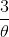
- Minor detail: Navigating 2 paths between 2 pairs of distringuished points.

## Total Expected Time
- 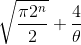

## Expected Space
- 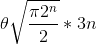 bits.
- Size of a table entry: 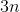 `(x_i, i, LP)`

### Example
- n = 128
- h: {0, 1}(128) -> {0, 1}128

#### Naive Method
- Time ~ 
- Space ~  tbytes

#### VW Method
- 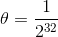
- Time ~ 
  - Note that since were only storing 1 in ~billion results, lookup time is negligible.
- Space ~ 256 Gbytes
  - Feasible for consumer to obtain this much storage

## Parallelizing VW (with m processors)
- Ideal case: Hope for a speed up factor of m
- Idea: Have each processor pick a different starting point.
  - For each machine, pick a different (random) starting point
  - Each machine reports the distingished points to a central server.
  - Sequences could collide with itself, or with another processor.

### Expected Time
- 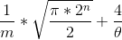

### Expected Space
- same as before
- 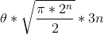
- Note, would need some additional space to store the index of the processor (say an extra n bits), which is negligible.

### Notes
1. Speedup is by a factor of `m`
2. Communication does not need to happen between processors, only to the central server.
3. **Objection**: Realistically, the collision produced are really 2 random messages. Therefore, useless in a specific application.
  - Note: Small modifications to the attack can be made to produce meaningful collisions.

## Finding Meaningful Collisions With VW

- let  "Alice owes Bob $1 million...."
- let  "Alice owes Bob $1...."
- Alice would like to find variant 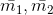 of 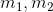
  - Change the message from a bit-string point of view, but keep the same meaning
  - Such that 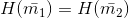

- Define 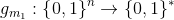 as follows
- Fix n positions in , say 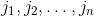
- Then for n-bit string , define 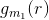 by adding, for each 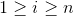, a space at position 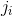 iff the ith bit of r is 1.
- **Note**  has the same meaning as .
- Do the same for 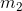, define 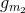
- Define some function f: n-bit -> n-bit
  - Divide n-bit strings into 2 sets  of equal size. (say bitstrings starting with 0 or 1)
  - Then for bit-string r, define 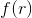
    - Check if 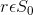, compute 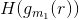
    - Otherwise, 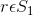, compute 
- If H is a random function, the so is f
  - Since f applies H, a random Hash value, it must also be random
- run parallel VW to find a collision for f.
  - (a, b): collision
  - 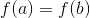
  - We hope (with prob 50%) that they are in different sets. Say  and 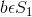
  - 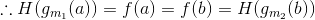
- Let 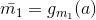 and 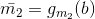
- Finally, 
- So we have found a meaningful collision for H.

### How to resist the attack?
- Don't use a bit-length of 128

