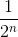
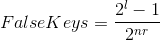
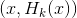
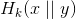

# Lecture 14 - February 2, 2018

## Daum-Lucks Attack
- Attack on MD5 for PostScript files
- Pick some preamble, that is a multiple of the block length
- Use this to falsify messages
- Can use 1 useless collision to generate any file with the same hash.
- extendible to arbitrary binary programs

### Protection
- A user could inspect the postscript file, but in reality no one does this

## Message Authentication Code Schemes (MAC)
- MAc scheme is a family of functions, mapping arbitrary-bit strings to n-bit strings
- has a parameter k, which is an l-bit string
- , outputs the tag of x with key k.
- allows a scheme for providing data integrity and data origin auth

### Applications
1. Alice and Bob establish some secret key
2. Alice computes the tag, sends the message and tag to Bob
3. Bob verifies the tag

- Integrity: since the attacker doesn't know the secret key, the tag won't match
- origin: again doesn't know the secret key, tag won't match, probably not from alice
- No confidentiality or non-repudiation
  - Message is open
  - Bob could just generate some key and tag and say that it came from Alice
    - Can't distinguish between tags that Alice generated or Bob generated
- Doesn't prevent against replay attacks
  - use some sort of sequence
  - timestamp

### Security
- Assume the attacker knows everything about the MAC scheme, except for the secret key
- **Goal of the attacker**: Eve needs to convince Bob that a message she sent was from Alice.
  - i.e. correct a message x and tag without knowing the secret key
  - Eve is able to collect pairs of messages and tags
  - **Chosen Message Attack**: Eve may be able to pick messages for Alice to tag.
    - Harmless messages for Alice (i.e. contract worth $1) is all Alice will sign
      - Whatever Alice will tag for you
    - Goal: Eve needs to tag harmful messages for Alice
      - Whatever Alice won't tag for you
    - Compute the tag on any message

#### To be secure
- The MAC scheme must be existentially unforgeable against chosen-message attacks
- **Assignment 3, Q3**
  - First 3 problems from todays lecture

### Ideal MAC Scheme
- **Propery**: For any l-bit key, the function  is a random function.
- Note: this is useless in practice since we can't program a random function
  - analysis purposes

#### Generic Attack on MAC scheme
- select a random tag, assume it is the tag
- since H is random, each guess has Probability of correctness of 
- **Note**: Guesses can't be directly computed
  - Can't check offline
  - Online: few guesses, limited time
- This is realistic for small n.
- In reality use 

#### Generic Attack 2
Exhaustive key search

- Given r known message tag pairs
- 
- Expected number of steps: 

### MACs based on Block Cipher (CBC-MAC)
- Assume that all plaintext messages all have lengths that are multiples of n
1. Divide x into r n-bit blocks
2. Compute the tag
3. For each block compute 
4. Then 

#### Security
- Provided by theroem
- Makes the assumption that  is an ideal encryption scheme (block cipher)
  - It may not actually be.
- Need to used fixed-length inputs.

#### Attack if arbitrary lengths
1. attacker picks a block
2. obtain the tag for the message
3. encrypt it
4. obtain the tag of the tag
5. this tag is also the tag of the 2-block message `(x, 0)`

Note: While this attack is silly, it **still** breaks the notion of security as defined. Thus, the MAC scheme is insecure if arbitrary length.

##### Fix Encrypted CBC-MAC
- CBC-MAC as before
- Encrypt the last block under a second key s
- **Theorem:** If E is ideal, then this MAC is secure for inputs of any length

### MACs based on Hash Values
- Problem: Public fixed function, with no secret key
- `H`: An iterated n-bit hash function, without the length block
- Note the compression function
- keys are n-bit strings
- Block K is key padded with  0's

#### Secret Prefix Method
- Use K as the first block
- hash the message blocks
- if  is known
- Can compute 

#### Secret Suffix Method
- Add the key block to the end of the message
- Previous attack doesn't work, appending y means Key is in a different place
- If there is a collision then finding a collision for the tags means the tag will work for the second message
- Security relies on the hash function being collision resistent
