# Lecture 15 - February 5, 2018

## Authentication
- Alice and Bob pick a secret key
- Alice computes the tag (using the secret key) and sends it to Bob
- Bob also computes the tag and ensures they match
  - If so, he accepts the message
  - If not, he rejects the message

### Security
- Insecure if it is computationally infeasible to compute the tag for some given message.
- Low probability of success
- Can't compute for tag for any new message x.
- **The MAC scheme must be existentially unforgeable against chosen message attacks**

### CBC-MAC: review
- Based on block cipher
- Apply encryption function to blocks
- Chaining operation 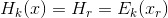
- Secure against fixed length inputs
- For variable length, chosen message attack
  - Exploit 0 block

#### Encrypted CBC-MAc
- CBC-MAC
- Encrypt the tag
- Secure for inputs of any length
  - Assuming it has an "ideal" encryption scheme

### Hash MACs
- MAC that use a hash function
- H is some n-bit iterated hash function
- have some n-bit key appended with 0's

#### Secret Prefix Method
- Apply the key as a prefix
- Length extension attack: Can append message y to some message x
  - already know 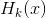

#### Secret Suffix Method
- Like prefix, but apply the key as a suffix

##### Problem
- If a collision can be found for messages of the same bit length, then their tags will be the same.
- Requires the hash function to be collision resistent to be secure.
- hard to guarantee in the real world

#### Envelope Method
- A combination of both prefix and suffix 
- Appears to be secure, no serious attacks have been found.

#### HMAC
- Define 2 constant r-bit strings inner-pad (ipad) and outer-pad (opad)
  - Only requirements for these is that they must be different.
- Ex. 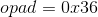 repeated
- 
- Similar to envelope method, first round apply prefix, next apply suffix.

##### Security
- Can be proved by a theorem
- Assumes that the compression function used in the hash function is a secure MAC
  - **Merkle**: If f is Collision resistent, then H is collision resistant.
  - **Bellave-Caneth-Krawczyk (BCK):** If f is a secure MAC, then HMAC is a secure MAC.
- Recommended that people use SHA-256
  - But SHA-1 and MD5 are both used in practice.

##### Key Derivation function
- Application HMAC
- Alice has some secret key, she wants to derive many session keys
  - Used to encrypt traffic
- 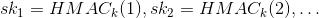
- Without any knowledge of k, an attacker can't learn anything given some 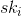

## Authentic Encryption
- Encryption gives use confidentiality
- MAC schemes (HMAC) provide authentication
- We want both in practice

### Encrypt and MAC
- Alice sends $$(c, t) = (E_{k_1}(x), H_{k_2}(x)) to Bob
- Bob decrypts the message and computes the tag, ensures that they match

#### Problems
- Given a generic enryption scheme and generic MAC scheme
- The MAC scheme could leak information about the plaintext, it doesn't necessarily hide it.
  - Trivial problem: The MAC scheme is some tag with the entire plaintext appended to it.
  - A perfectly valid MAC scheme, but no confidentiallity

### Encrypt-then-MAC
- Recommended
- 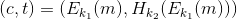
- Apply the MAC of the ciphertext
- Bob computes the tag of the cipher text and verifies
- If it is ok, Bob can decrypt the ciphertext and accept the message.

### Special Purpose AE-Schemes
- AES-GCM: Galois/Counter Mode
  - Recall ECB: Block at a time
  - CBC
- Allows for data that is authenticated, but not encrypted.
  - Ex. HTTP-headers: Other computes want to read to properly route packages
- Uses AES-CTR (counter Mode) and a custom encryption scheme.

#### CounTeR Mode
- Simiar to stream cipher mode
- Uses AES to give you a key stream.
- 128-bit secret key
- A plaintext message, m, broken into 128-bit blocks
  - Upper bound on the number of blocks in a message 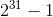
  - Google gets around this by breaking a file up into chunks (each of which is below the upper bound)
- IV 96 bits
- 
- For each message block i:
  - 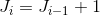
    - Basically add a counter
  - 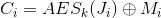
- Send 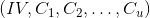

##### Decrypt
- IV with 0's
- Increment the counter and XOR with each Ciphertext block.

##### Notes
- Since IV is random, the same IV is unlikely to be picked (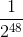 - Birthday paradox)
  - **Don't reuse IV's**
  - Use good key rotation to help mitigate.
- Same messages should have different ciphers
- Can be parallelizable
  - Give each machine a range of blocks, start the counter in the right place

