# Lecture 18 - February 12, 2018

## Public Key Crypto
- Generate a key pair 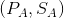
- 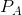: Public Key for Alice
- 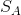: Secret key for Alice

### Encryption
- Alice encrypt's her message with 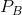, Bob's public key 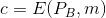
- Bob can decrypt the message: 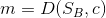

### Digital Signatures
- Alice computes a signing function using her secret key
- Bob can verify the message using Alice's public key
- Signatures depend on the messages being sent
  - Not the same as a physical signature, i.e. the signature is not the same
  - Can't just cut off the signature and append to a different message
- Large application: Software updates
  - Can't use a MAC scheme, Microsoft can't share the same key with Alice and Bob
  - Instead, Microsoft broadcasts the signed software to everyone
  - Each user can verify the update using Microsoft's public key.

### Advantages over Symmetric-Ley
- No need for secret channel
- Only 1 key pair
- A signed message can be verified by anyone

### Disadvantages for symmetric-key
- Public keys are larger than symmetric key
- Public-key schemes are slower than symmetric key schemes
- **In practice**: combine both

## Hybrid Scheme
- Functionalty of public-key and speed of symmetric key

### Encryption
Alice does the following:
- Compute a signed message using her secret key
  - In practice, sign the message
  - If the hash function is collision resistent, then can't generate collisions, valid signature
- 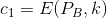 and 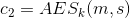

### Decryption
- Bob first decrypt's  using his secret key
- Uses the symmetric secret key to decrypt 
- Bob can then verify using Alice's public key

## Algorithmic Number theory

### Fundamental Theorem of Arithmetic
- Every integer 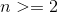 has a unique prime factorization
- Question: What is the factorization -> how to find it?
  - Can it be found **efficiently**?
  - No great algorithm to do this
- How do we efficiently veify an alleged prime factorization
  - Need to check if the given factor's are prime
  - this can be done quickly
- Given an integer, how do we efficiently decide whether n is prime or composite?
  - this can be done quickly

### Complexity Theory
- Measure efficiency in terms of the input size
- Number of bits: 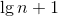
- An algorithm is polynomial time: 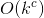

#### GCD

##### Naive Method
- Write 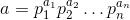 (prime factorization)
- 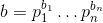
- Note that since we don't have an efficient algorithm for prime factorization, so this is not polynomial time

##### Euclid's Method
- Find the answer without factoring everything
- Find 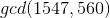
- 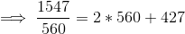
- 
- 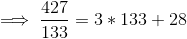
- 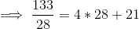
- 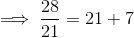
- 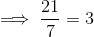
- 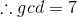
- k-bit numbers
- At most  divisions, 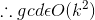
  - Worst case is sequential fibbonacci numbers
  - See A4 for another gcd algorithm to analyze.

### Modulous Arithmetic
- k-bit integer , integers 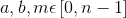
- 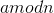: the remainder upon deviding a by n.

#### Inverse
- 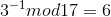, note that 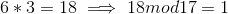
- Can be efficiently computed using the extended euclidean algorithm

#### Exponentiation
- to compute 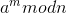 first compute 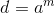, then 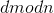
  - This is not polynomial time, 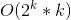
- Want: 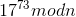
  - Write 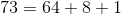
  - 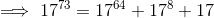
  - Then repeatly compute 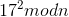
  - Note: Never increases to more than 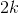 bits
