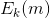
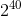
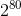
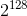
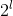

# Lecture 2 - January 5, 2018

## Enigma Machine: WW2
- Key is some settings on rotors and plug boards
- Alice would type her message on the keyboard to produce the cyphertext.
- Send the cypher to Bob, who would type in the cypher to decrypt the message.
- Alan Turing helped to decrypt the enigma machine by finding the rotors and plug board settings.

## Lorenz Machine: WW2
- A more secure version of Engima
- The British captured encrypted communications from the machine and were able to reverse engineer

## Simple Substitution Cipher
- M all English messages
- C all encrypted messages
- K All permutations of the English alphabet
-  apply permutation k to m, one letter at a time
-  apply inverse permutation  to c, one letter at a time.

### Is the simple substitution cipher a secure SKES?
- I.e. is it secure? -> No, vulnerable to a chosen plaintext attach

## What Does ti mean for a SKES to be secure?

### Security Model
1. What is the adversary's goal
2. Computational powers of the adversary
3. How does the adversary interacte with the communicating parties
  - Assumption: Knows everything about the scheme used, not the secret key
  - This works because you can't keep algorithms secret, people can reverse engineer

### Adversary's interaction

**Passive Attack**:
- Ciper-text only: adversary knows some ciphertext
- Known-plaintext attack: The adversary also knows some plaintext and the corresponding ciphertext
  - At least as strong a known-plaintext

**Active-Attack**
- Chosen-plaintext attack: the adversary can also choose some plaintxt and obtains the corresponding ciphertext.
  - store a secret key on laptop and phone, when your laptop recieves an email it encrypts and sends to phone.
  - Adversary sends an email to the laptop and captures the ciphertext
- Clandestine attach: bribery, blackmail
  - Put a :gun: to their head
  - Math can't help out here :sad:
- side-channel attacks: monitor the encryption and decryption equipment
  - timing attacks
  - power analysis attacks
  - electromagnetic-radiation analysis

### Computational Power of the Adversary
- Information-Theoretic security: Eve has infinite computational resources
- Complexity-theoretic security: Eve is a polynomial time Turing machine
  - A computer
  - Helps with proofs
- **Computational security (this course)**: Eve has 10,000 Intel Xeon

### Adversary's Goal
Order of decreasing strength

1. Recover the secret key
2. Systematically recover plaintext from ciphertext (without key)
3. learn some partial information about the plaintext from the ciphertext (other than it's length)

We will try to build schemes that guard against the weakest possible threat (because we're paranoid).

If the adversary can access one or two insecure

## Secure SKES

> A symmetric key encryption scheme is said to be secure if it is semantically secure against chosen plaintext attack by a computationally bounded adversary

To break a symmetric-key encryption scheme:
1. The adversary is given a challend cipher text c
2. During it's computation, the adversary can select lpaintext and obtains the corresponding ciphertext
3.

### Desirable Properties of a SKES
1. Efficient algorithms should be known for computing
2. The secret key should be small enough that it is easy to transmit, but hard to enumerate (brute force)
3. scheme should be secure
4. secure against the designer of the algorithm

### Work factor
-  operations is very easy
-  is easy
-  is feasible
-  is barely feasible
  - This is feasible by the Bitcoin network
-  is infeasible
  - The landauer limit suggests that exhaustively trying  symettric keys would require 30 gigawatts of power for 1 year.

### Security Level
> A crypto scheme is said to have a security level of l bits if the fastest known attack on the scheme takes approximately  operations.

## One-Time pad
- Key is random string is letters
- The key is as long as the plaintext
- Vernam in 1917
- **Never reuse the secret key**

This does not involve the key!

## Binary Messages

### Convention
Messages and keys will be assumed to be bit strings

Perform XOR on message and key to combine

## Stream Cipher
- Use a small purely random string as the key
- Use this key as the seed in a pseudorandom bit generator to generate a keystream.
- Keystream XOR plaintext to produce cypher
