# Lecture 20 - February 16, 2018

## RSA
Note that to avoid collisions, make sure m is strictly less than n. Avoid mod n information loss.

### Key Generation

- Alice's Public Key: 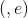
- Alice's Private Key: 
- Encryption: 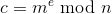
- decryption: 
- 
- 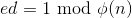
  - , 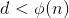

### Security

1. If Eve can factor n, then Eve can compute  efficiently, and thus totally break RSA. So, hardness of factoring  is *necessary* for RSA security.
2. **Fact**: Computing  from  is *equivalent* to factoring .
3. The probem of finding  root modulo  (the "RSA problem"). Which must be hard if RSA encryption is to be secure.
4. It is **believed** that finding  roots mod n is equivalent to factoring n. So, hardness of the RSA problem is **necessary** for security of RSA encryption.
  - Very important to note that this is a belief.
5. RSA encryption as described above is **insecure**
  - See below

#### Attacks

##### Dictionary Attack
Suppose that the plaintext message, m, belongs to a small and easily predictable set of messages
- Encrypt all possible m's in the message space, when the ciphertext matches, know the plaintext.
- simply lookup ciphertexts in the table

###### Salting
This attack can be defended against by appending a random string to the start (or end) of the plaintext, before encrypting. This is called **a salt**.

##### Chosen Ciphertext Attacks
- The attacker (Eve) has a decryption oracle available
- Eve is given a challenge ciphertext which she has to decrypt
- Any ciphertext can be decrypted, except c.
- **Goal**: Learn something about the plaintext for c.
  - Other than it's length

**Attack**: Select  with 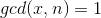
- **Note**: If 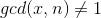, then *stop*. You have factored n and totally broken the encryption.
- Compute 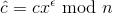, where 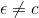
- Give  to the decryption oracle, and obtain 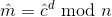
- **Note**: That 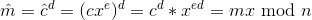
- Compute 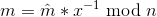

###### Are these attacks feasible?
- Chinese mobile browser case study
- browsers track users, where they are, and what they are doing
- QQ browsers WUP encryption
  - Randomly generate a 128-bit AES session key $$k = i || j$
  - Encrypt k with the server's RSA public key
  - encrypt m using AES-ECB
  - send  to the server
- Server decrypts:
  - uses it's RSA private key to decrypt  to get k
  - Use k to decrypt 

**problem**: , n is 128-bits, meaning p and q are 64-bit, which is feasible to compute.
- The same 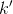 was embedded in 500-million cell phones.
- The number of possible k's is 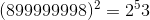
- ECB mode is also bad
- no authentication
-
