# Lecture 21 - February 26, 2018

## Chosen-Ciphertext attack on Revised WUP

- k: 128 bits
- 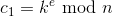: 1024 bits
- 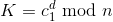: 1024 bits
  - The rightmost 128-bits should be 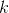
  - The rest are all 0's
- **Flaw:** They don't check the formatting (i.e. they only extract )

### Restricted Chosen Ciphertext attack on QQ Browser (6.5.0.2170)
- **Given**: Target 
- **Goal**: Compute , and then 
- **Restricted Oracle**: If you give an improperly formatted ciphertext, then the server will reject the message
  - You learn the ciphertext / plaintext was not properly formatted.
- **Attack**: We'll learn the bits of , one at a time:
  - $$k = k_{127} \mid\mid \ldots \mid\mid k_2 \mid\mid k_1

#### To Find k

- Compute 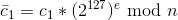
  - i.e. 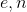 are the server's public key
  - **Note**: 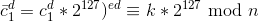
  - 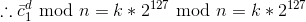
    -  shifted by 127 bits
    - 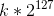: 255 bits, n is 1024 bits
  - first 128 k, 127 are 0's
- Note that the server decrypts  and obtains 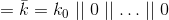
- Don't know if $k_0$ is 1 or 0
  - Guess that $k_0 = 1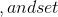k' = 1 \mid\mid 0 \ldots 0$$
  - Select 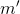 and compute 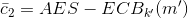
- Send 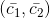 to the QQ server
- The server decrypts 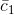 to get 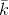
- Note: If 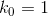, then 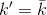, so 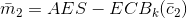 is properly formatted
  - If , then so 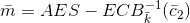 is likely garbage. And therefore, the server won't respond
- You learn 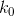 depending on the response recieved from the server.
  - If it responds, you guessed correctly: 
  - If it doesn't respond, you guessed wrong: 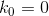
- Proceed similarly for 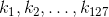, shifting k by 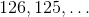 using your previous guesses.

## How to defend against chosen ciphertext attacks in practice
- **Definition:** A public-key encryption scheme is secure if it is semantically secure against chosen-ciphertext attack by computationally bounded adversaries.
  - Given access to a decryption oracle

### Approach 1: RSA PKCS 1 V1.5 Encryption
- **PKCS**: Public Key Cryptographic Standard, 1993
  - Used in SSL

#### Encryption

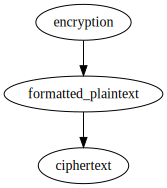

#### Decryption

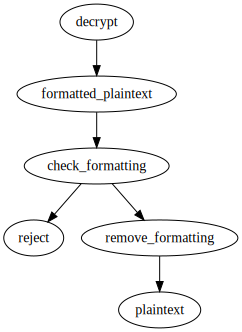

#### Formatting
- Have a formatted plaintext  that is t-bytes long
- 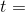 the byte length of n
- Set  (the real plaintext) to the right
- 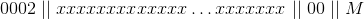
- xx's -> The salt: Non zero-bytes random to fill in the space (at least 8 consecutively)
  - **Why random?**: Prevent a dictionary attack

### Approach 2: RSA-OAEP Encryption (1994)
- Let  be the **bit** length of the modulous, n (ex. 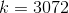)
- Salt 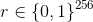

#### Formatting and Encryption
  - 
  - 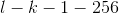: Length of M + 256 0's
  - 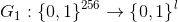
  - 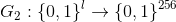
  - 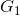 and 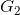 are random functions implemented with hash functions
  - 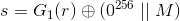
  - 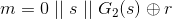
    - The point of this is to discuise the salt and plaintext
    - **Think**: Similar to a 2-step feistel network

#### Decryption (given c)
- Compute 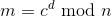
- Parse m: 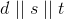
- Check that 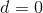
- Go backwards:
- Compute: 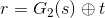
- Compute: 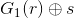 and parse to get 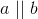
  - a should be 256 bits long
- Check that  is 256 0's
- Then the plaintext is 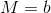

#### Why is this secure?
- Provable by theorem.
- See next class
