# Lecture 22 - February 28, 2018

**OAEP**: Optimal Asymmetric Encryption Padding

## RSA-OAEP
- Recall salt is added to prevent dictionary attacks
- Chosen ciphertext attack are prevented via the padding
  - The attacker has some valid ciphertext c, they would try to modify it (or create one). Since the random functions are applied it is likely that the resulting plaintext will be garbage.

### Example
- $$G_1(r) = SHA256(1 \mid\mid r) \mid\mid SHA256 (2||r) || SHA256(3 || r) || \ldots

### Notes
1. RSA-OAEP is **plaintext aware**: If any party computes a valid ciphertext , then that party must know the plaintext 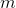.
  - Just picking ciphertexts are likely to be garbage
  - If you know the plaintext and ciphertext, then there's no point using the decryption oracle
2. **Theorem (Bellare & Rogawey)**:
  - Suppose finding 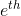 roots mod n is hard (RSA relies on this, otherwise you could just find the roots).
  - Suppose  are random functions
  - Then RSA-OAEP is **secure** (semantially against chosen-ciphertext attacks against an adversary)
    - Proven using the power of math
    - This is what the QQ browser should have used, not possible to do chosen ciphertext attacks.
3. We *believe* that finding  roots mod n is equally as hard as factoring n
  - We can't prove this
4. In practice 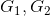 are pseudorandom functions (i.e. not truely random)

**Problem**: The theorem has no value in practice. As  are pseudorandom then the theorem isn't applicable.
- Nonetheless, the theorem does prove security against attackers who treat  as random functions.

In any case, a proof with artifical assumptions is better than no proof at all.
- maybe.....

**Shoup in 2000 discovered that the poof was wrong. Shoup patched the proof**

RSA-OAEP is included in the latest version of TLS 1.3, March 2018.

## Status of Integer Factorization
- Crutial for the security of RSA

### Little-o
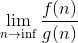
- g dominates f as n gets large

### Polynomial Running Time
- 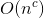
- n is input size
- c is a constant

### Exponential
- Not polynomial
- fully exponeital of the form 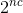
- Subexponential: of the form 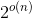
  - 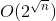

### Trial Division
- Trial divide n by the primes 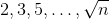
- 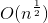: not n is not the input size
  - 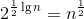: exponential in the input size

### Subexponential Time
- 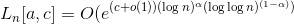
  - Subexponential if 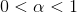
- 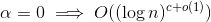, polytime
- 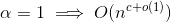, which is fully exponential

### Special Purpose Factoring
- Slow in general
- But fast if the number is of a special form
- Example: Trial division is fast when the factors are all very small

### General Purpose Methods
- Work on any n
- running times do not deend of any properties of the number being factored
-
