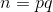
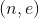
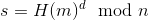
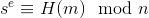
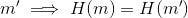
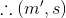
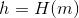
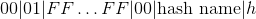
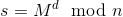
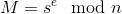

# Lecture 23, March 2, 2018

## Equivalent Security Level
- Dependent on the capabilities of integer factorization
- NVS

## RSA Signature Scheme

Each entity A does the following:

1. Randomly select 2 large distinct primes p and q
2. compute 
3. Select arbitrary 
4. Compute d, private key
5. public key is 

### Example
- Alice wants to sign message **m**
- private key d must be used to sign, public key to verify

#### Signing
- : Is an RSA signature
- Alice would send the message and the signature to Bob

#### Verification
- Bob would use Alice's public key to verify
- 

### Security
- Requires that finding e-th roots mod n is an intractable problem
- RSA problem has to be hard (same as encryption)

#### Security properties of the hash function

##### Preimage resistance
- If not, an attacker can incover a message that would equal the hash

##### Second Preimage Resistant
- If not: given  can find a 
-  is valid

##### Collision resistance
- Can select two messages with the same hash value
- Ask alice to sign one of the messages
- The signature is valid for the other

#### Goals of the adversary

1. **Total Break**: E can recover the private key, or can compute the signature for any message of their choice
2. **Existential Forgery**: E forges A's signature for a single message, E may not have any control over the structure or content of the message

##### Attack model
1. **key only attack**: Attacker only has public key
2. **known message attack**: E knows some message, signature pairs
3. **Chosen message attack**: E can pick messages of their choice, get alice to sign them. E can then compute the signature for any future message (not already signed by Alice)

##### SEcurity Definition
- Signature scheme is said to be secure if it is existentially unforegable by a computationally bounded adversary who launches a chosen mesage attack.
  - **Note the similarity to the security notion of a MAC scheme**
- Adversary has access to a signing oracle, goal is to compute a single valid message signature pair

###### Is sha 256 secure if used
- No, if the hash values are much smaller than the bit length of the modulous
- Make the hash values at least as big as the modulous
- Use "full-domain" hash RSA

### Full Domain Hash RSA
Map the hash values to the full domain of the RSA function

- Theorem: if RSAP is intractable and H is a random function, then RSA-FDH is a secure signature scheme.
  - As before H will be random-like in practice.
  - Therefore, the theorem doesn't always apply in practice.

#### How to extend hash values to full domain
- **naive way**: is just repeated hashing with a counter

##### PKCS

###### Signing
- compute , where H is a hash function (ex. SHA-1, SHA-256, ...)
  - Point is the hash function is not fixed
- Format h:
  - Let k by the byte length of n
  - To the right of the hash, append 15 byte hash name
    - This is an ISO standard table
  - 
- Finally sign the formatted hash value: 
- Alice sends the message and the signature

###### Verification
1. Obtain an authentic copy of Alice's public key 
2. Compute , to obtain the formatted hash value
3. Check the formatting (from left to right)
  1. Ensure that the padding matches (00, 01, FFFFFFF...., etc)
  2. Extract the hash name
  3. Use that hash function to hash the message
  4. check that the hashes match up
  5. Need to check that there are no more bytes left over
    - Buffer underflow attack
4. Either accept or reject the message

###### Bug: "Buffer Underflow Attack"
- RSA signatures can be forged by hand
- PIck any message, hash it, then you can write the signature by hand
- **Need to check that there are no bytes left over**

Highlights the importance of being specific in standards.
- Similar: "Uniform and Independtly random primes" when selecting RSA primes, some people just pick the next prime (both are random, but not independent)
