# Lecture 24, March 5, 2018

## Bleichenbacher's Attack - Break PKCS 1 V1.5 RSA signatures by hand
- 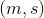: message, signature pair
-  = Padded Hash value, k bytes long (k is the byte length of the RSA modulous)
- 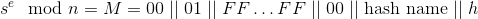:
  - Hash name: 15 bytes long
  - The way the standard was written meant it didn't specify that there are anything at the end of the padding, the basis of this attack.

### Assumptions

1. n: 3072 bits long, WLOG
2. Suppose H = SHA-1 (again WLOG)
3.  (widely used in practice, efficiency reasons)
4. Verifier doesn't check that there are no extra bytes at the end of the padding (after h)

### Attack

1. Select an arbitrary message, m
  - Note that this is a total break, can use any message you choose
2. Compute the has of the message, 
3. Let 288 bit string 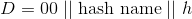
4. Let , note that 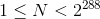
5. Suppose that 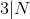 (Happens with prob 
  - IF not, modify m slightly and goto 2
6. Let 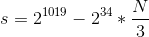

#### Prove The claim: The verifier will accept (m, s)

The verifier computes 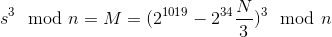
- Note that 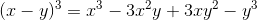
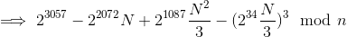 (call the last 2 terms garbage)
- 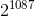 dominates the 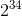, thus the garbage is positive
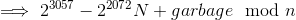
- Again the 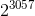 term dominates, the the result is positive and 
- Because of this, we can ignore the , thus the problem looses it's hardness (cube roots are easy to find, cube roots mod n are hard)

Writing this as a bit string, we can see that left bit shifts are applied
- D is shifted to the right 2072 bits to the left
- Note that 2^{697} - 1 is just a string of 697 1's

3072 bits:

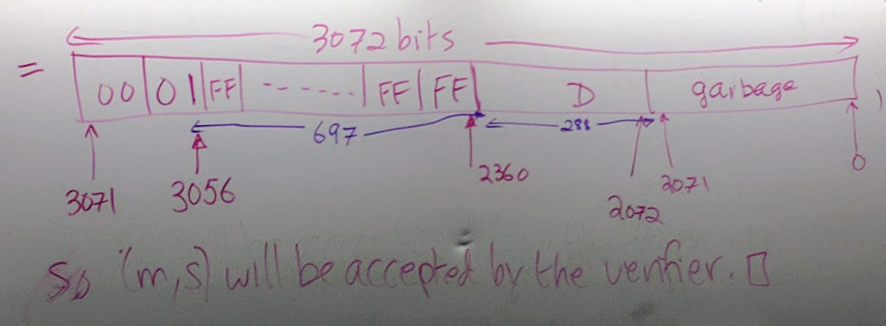

## Key Management
- Whatever it takes to support the establishment and maintenace of keys for many users

In practice, you have to manage a huge number of keys to secure all data.
- Recall Google's key management

1. Suppose A wishes to use public key crypto to encrypt a mesage for B: A needs an authentic copy of B's public key
  - Send a confidential email
2. Suppose A recieved a message purportedly signed by B. To verify the signature on the message, A needs an authentic copy of B's public key
  - A person wishes to verify a software update

### Public Key Management
- Where do you get the key, verify it?
- How to do keys with properties?
  - I.e. bank wants to limit the total transaction size of Bob's public key
- What happens if private keys are lost/compromised?
- How can a public key be revoked?

In the real world, public key management is hard.

#### Techniques for distributing

1. point to point delivery
  - trusted courier
  - Hard to implement at scale
2. Direct access to a trusted public file
  - Digitally signed file
3. Use of online trusted servers
4. Offline Certification Authority (CA)

### Certification Authorities
- CA issues certificate that bind an entity's identity and it's public key
- Certification constist of
  - Data part: A's identifiy, public key, and other info (validity info)
  - Signature part: CA's signature of the data part
- B obtains an authentic copy of A's public key
  1. obtain an authentic copy of the CA's public key (shipped in browser or OS)
  2. Obtain CertA over an unsecured channel
  3. verify the CA's signature S on Data
- The trust is now concentrated to trusting the CA's public key
  - The CA doesn't need to know the user's private key
  - The CA must be trusted to not create false certificates

### Public Key Infrastructure (PKI)
- The supporting services (tech, legal, business) that are needed if public key crypto is to be deployed at scale

#### Contains
- Certificate format: Needs to be right at the beginning, very hard to change
- the certification process
- Certificate revocation
  - Warn users not to trust certs anymore
- Trust models
  - Hope the CA did it's job well
- Certificate distribution
- Certificate policy: Details of intended use
- **Certification practice statement (CPS)**: Practices and policies followed by the CA
  - Describes how the CA is liable to you, it they do something wrong

#### Problems
- Interoperability
  - Have standards
- Revoke Certs
- Trust models
- Liability: Whose liable to you, and for how much
  - Business model: Charge users to provide certificates and handle liability

