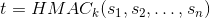
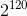
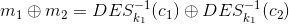
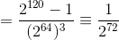
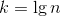
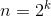

# Lecture 25 (Midterm Q&A) - March 7, 2018

## Encryption at Google on MT?
- Very little
- Mostly just used as a vague case study.

## Relationships between hash function properties
- Pre image: Given some random hash function value, find a message x that sums to that hash, in a feasible amount of time.
- 2nd PreImage: Given an input, find a second distinct message whose hash is the same, again feasible amount of time.
- Collision resistance: Find two distinct inputs that sum to the same hash

The following examples only focus on uniform hash functions (i.e. no contrived examples )
- Always prove these with the contra-positive
- **NEVER SAY "EXISTS"**: they always do, the attack just needs to be feasible

- Note that PR does not imply 2PR
- 2PR does not imply CR

## Real world example of encryption / decryption oracles

| . | Public Key | Symmetric Key |
|-|-|-|
| Encryption | You can easily get the public key and DIY | Alice and Bob are devices owned by the same party (home and work computer) |
| Decryption | QQ Browser, you can get partial information back, formatted plaintext or no response (restricted chosen ciphertext attack) | Similar thing |

## Key Derivation Functions (KDF)
- Sample as many sources as random bits as possible
- KDF mixes up all of the sources of randomness
- 
- 

## Sample MT 1

### 3
- Goal of question, show how the modification to DES doesn't help

#### Part a
- 

#### Part b
- By exhaustive key search: Can solve in  steps (infeasible)
- can compute 
  - Make a guess for , check that you get the result (check you can get k2).
  - If yes, check on the other pairs
- We want the number of false keys to be close to 0.
  - The number of foreign keys 

### 4b
- ECB Mode is not semantically secure
  1. If someone encrypts the same plaintext blocks, the ciphertexts are the same
  2. Chosen plaintext attacks: Can learn information about the plaintexts by guessing
- CBC works by chaining blocks together, can't perform the same chosen plaintext attacks
- Useless Block Chaining (as defined in the question), show that's is not better
  - Why useless? You know the previous blocks, can simply XOR. Then it's the same case as ECB mode.

## Sample MT 2

### 1g
- Polytime: in terms of the input size
- Iterate from: ,
  - Bit length of n is 
  - Algorithm takes  steps
- Therefore, not polynomial time.

### 3c
- Show CBC mode is not semantically secure against chosen-ciphertext attack
  - Note that it is against chosen plaintext attacks
- Have a decryption oracle, can decrypt anything except for the chosen ciphertext
- Given a target ciphertext, modify it (flip 1 bit of IV), gives a new ciphertext
  - can check that it's the same as the original plaintext, with the first bit flipped (then flip it back to get the original plaintext)
