# Lecture 27 - March 12, 2018

## DigiNotar
- was a CA, root CA embedded in all browsers.
- Issed hundreds of false certificates (including for `*.google.com`)
- Directed 300,000 iranian gmail users to a false site.

### Dealing with CA Breaches
- Browser developers (Apple, Google, Mozilla), want users to trust their browsers, as well as the websites they visit.
- **Extended Validation:** Root CA's must now meet stricter requirements (doing so gives you the green bar)
- **Certificate Transperancy**: CA's publish all of the certificates that they publish
  - Append only, they can't remove past certs

## Methods of Establishing Shared Secrets
- Use of RSA is decreasing
- Now being replaced with Eliptical Curve Diffie-Helmen

## Ellpitic Curve Cryptograhy (ECC)
- Public-key crypto scheme
- alternative to RSA
- Developed in 1985
- **Definition**: Let 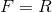 or 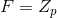 (integers modulo p 
  - If 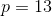
  - 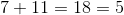
  - 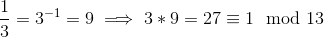
- An **elliptic curve** E over F is defined by:
  - 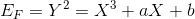
  - 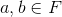
  - 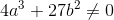
- In practical applications, we typically work with the integers mod p (it's hard to work with infinite sets!)
  - Elliptical curves over the reals give better geometric intuition.
  - Map this geometric intuition (over the reals), to algebra (over ints mod p)
- The set of **F-rational points on E**:
  - 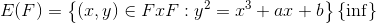
  - Where  is the point of **infinity**
  - 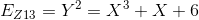
  - 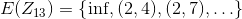
    - Always have , find the others by trial and error.
    - Example: No solution for 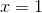
    - Note that this is a finite set, there are only so many possible x values.
  - **Note**: Let 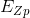
    - Then 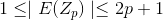
      - Always have the infinite point
      - At most, every x value has a solution, meaning 2 points + inf point.
      - **Hasse's Theorem**: Gives 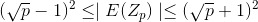
        - Notice that when p is very large, the size of the set is 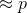
    - The size of this set is what will determine the security of the system

### Addition Rule
- Given two points 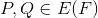, define a point 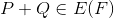

#### Chord Case
- Geometrically (in the reals): Draw a straight line through the points, the line will intersect the curve at a third point. The negation of that point is the addition.

#### Tangent Rule: Add a point to it's self
- Draw the tangent line of the point P
- Reflect the point of intersection

#### Vertical Case
- Drawing a vertical line, doesn't intersect the curve
- Define this case to 

#### Algebraic Definitions
Given 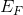 over a general field

1. 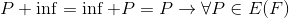
2. If 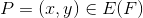 and 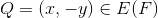, then 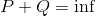
  - We write 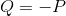
  - 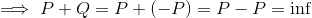
  - Sideeffect: 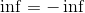
3. If 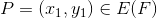 and 
  - Chord case
  - Want  and 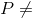
  - 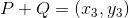
    - 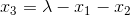
    - 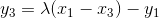
    - 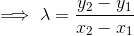
  - Note that this is always defined (not equal cases)
