# Lecture 28 - March 14, 2018

## Elliptic Curves
- Recall: 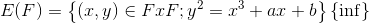
- Addition rules
  1. 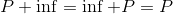
  2. If , 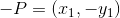, then 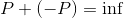
  3. If  and 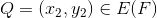, .
    - 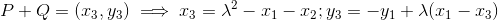
  4. If 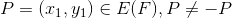 (<- case 2), then 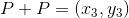, where:
    - 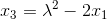, 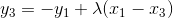, 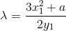
    - Note that 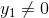, if it did then 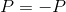, which is covered by case 2.

### Proof of 3

The equation of 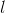 is 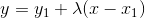, where 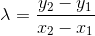:
- 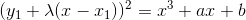
- 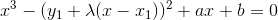
- We know 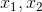 are solutions to this cubic equation. Let 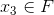 be the third solution.
- 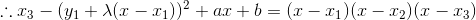
- Equate coefficients of 
- 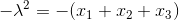, solve for 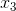
- 
- Note that there can only be one point of intersection (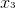)

- 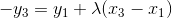
- 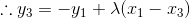

### Some Facts

The addition satisfies pleasing properties:
1. 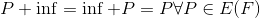
  - Implies  is the 0 point, as per the definition (no proof required)
2. 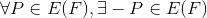 such that 
3. 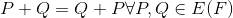
  - Commutative
  - Recall the rule geometrically, a line through P and Q is the same through a line through Q and P.
4. 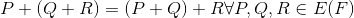
  - We'll skip the proof

### Elliptic Curve Descrete Logarithm Problem (ECDLP)

Let  be a prime, 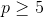, let 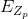, let n be the number of points (n is prime, if not try again until it is)
- Fact: Let , then 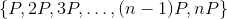 is pairwise distinct is equal to 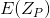 (all of the points on the curve).
- Lastly, 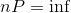, note 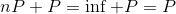, therefore a cycle.
- P is called a generator of the set of all points ()

**Problem Definition**: Given 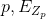, 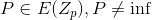 and . Find 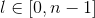 such that 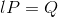.
- We say that 
- When n is very large, this is a hard problem.

#### Input Size
- 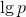 bits
- Everything is mod p, so all are  bits.
- 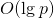 bits

#### Known Attacks
1. **Brute Force**: Add P to itself until you get Q.
  - You will eventually get Q as P generates all points
  - Run time is  point additions. Since n is roughly p (recall rounds), 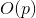 additions, which is not polynomial time.
2. **Shanks' Attack**: Write 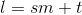 , where 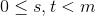
  - Then 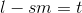
  - 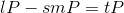
  - 
  - **Meet in the middle attack**
  - 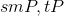 are on opposite sides of the curve
  - Each have 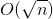 possible values
  - **Algorithm**
    1. For a table of points 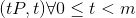 (sorted by first entry)
    2. Compute all possible  and look it up in the table.
    3. If , then output 
    -  (elliptic curve operations)
    - Again not polynomial, but better than brute force.
    - **Drawback**: High space requirements, 
      - Similar to Double-DES Attack, there's a trade-off (see next class).
  - How to compute ?
    - Add P to itself k times, efficiently
    - "Repeated square and add" (see A5), analogus to 
