# Lecture 29 - March 15, 2018

## ECDLP
Given 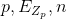 (n is prime)
- 
- 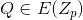
- 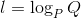

### Attacks on ECDLP
1. Brute Force
  - Keep adding P to itself until you get Q
  - At most, you will go until you get infinity
  - 
2. Shank's Algorithm (Meet in the middle)
  - Similar to Double-DES attack
  - Running time: 
  - Space: 
  - Can modify to trade-off space and time
3. Pollard's Alg
  - Recall VW (for hash collisions)
  - running time: 
  - Space: Negligible
4. Attacks on special elliptic curves
  - There are some weak curves that you shouldn't use. Can easily be avoided in practice
  - Not covered in this class

**TL;DR**: The fastest known attack on ECDLP has fully exponential running time ()
- **In contrast on RSA**, The fastest known attack on integer factorization hash running time 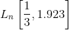 which is subexponential.
- Use these hard problems to choose the appropriate modulous.
- **Implication:** Since the fastest attack on ECDLP is slower than Integer Factorization, you can use a smaller params of Elliptic Curve Crypto than for RSA.
  - And you can do so while achieving the same security bit level.

### Comparison of Security Levels

Recall that 128-bit security level is ideal:
- BlackBerry's claim to fame was using a 256-bit security level, problem is that RSA is infeasible at this level, so they adopted ECC.
  - Basically did so for marketing reasons

| Security Level | Block Cipher | Hash functions (VW Attack) | RSA (Bitlength of n) | ECC (Bitlength of p) |
|-|-|-|-|-|
| 80 | SAKJACK | SHA-1 | 1024 | 160 |
| 112| TRIPLE-DES | SHA-224 | 2048 | 224 |
| 128 | AES-128 | SHA-256 | 3072 | 256 |
| 192 | AES-192 | SHA-384 | 7686 | 384 |
| 256 | AES-256 | SHA-512 | 15360 | 512 |

### Curve used in Practice (P-256)
- Provided by the NSA in 1997-1998
- Used 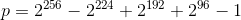
- Designed to work nicely with 32-bit machines / operations
- 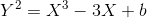
  - b is big
  - People don't trust the NSA, so there is a proceedure for selecting a b, start with a seed, enter it into SHA-1, check that you get p, check that the number of points are prime$$

### ECDH: Elliptic Curve Diffie Hellman (Key agreement)
- Internet is moving to this scheme to agree on shared secret keys
- Original Diffie-Hellman was based on RSA, not used any more

**Goal**: Alice and Bob want to agree upon a shared secret by communicating over an unsecured channel.
- Public params: P-256
  - Prime, equation of curve, number of points on the curve, a fixed point P (not )
- Alice picks a random number: 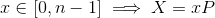. Alice sends $$X$ to Bob.
- Bob picks a random number: . Bob sends  to Alice.
- At this point, Alice and Bob have their own secrets (the logarithms of their respective points points)
- Multiply points by their secrets
  - They each compute computes 
- Now they share: 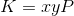
  - Note that computing x or y from X or Y requires solving the ECDLP problem, which is infeasible (if p is big enough, it is).

#### But.. this is insecure as is: Intruder in the middle attack
- The channel needs to be authenticate
- For example, check RSA public key.
- If an active attacker can impersonate Alice or Bob then they can intercept the communications.
  - Attacker impersonates Bob to Alice, and impersonates Alice to Bob. Establishes shared secrets with each of them.
  - Intruder selects 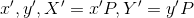
  - Sends  to Alice, 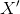 to Bob.
  - Alice computes 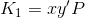
  - Bob computes 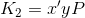
  - The attacker recieves an intercepted message from Alice, decrypts it using , encrypts it using 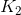 and sends it to Bob.
  - Alice and Bob are happy, but the attacker knows the plaintext.
  - **How to defend**: Alice and Bob should authenticate the channel, by signing X and Y using the RSA signature scheme (or ECDSA).

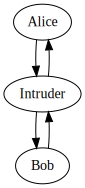

### ECDSA: Signature Algorithm
- Used in Bitcoin
- Next class
