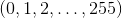
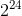
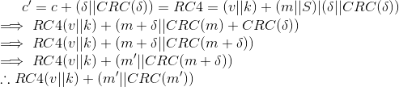

# Lecture 3 - January 8, 2018

## Symmetric Key Encryption Scheme
- Alice and Bob communicate some secret key over a secure channel
- Can use the key to encrypt / decrypt communications

### When is it secure?
When it is semantically secure against chosen plaintext attack by a computationally bounded adversary.

### One Time Pad
A key is a random string of letters that is at least as long as the message.
- This is secure, given a cyphertext, no matter how much computation you do, you can't derive any other information abount the plaintext. Only it's length.
- **Problem**: You can only use the key a single time. Example: XOR-ing 2 cyphertexts that have been encrypted with the same key produce the XOR-ed plaintexts.

### Stream Cipher
Secret key is now the seed to a psuedo-random number generator (PRBG).
- **Problem**: No longer perfectly secret, depends on the properties of the PRBG.

Requirements:
- The keystream must look like a random string
- If an adversary knows part of a plaintext and a corresponding cyphertext, then XOR-ing them together will yeild part of the keystream. This could potentially be usful to help generate the remainder, thus breaking the encryption.

**Note**:
- Don't use UNIX random number generators (`rand`, `srand`) for cryptographic purposes. Can predict once the seed is known.

### RC4
Very popular stream cipher.

Pro:
- Simple
- Fast
- variable key size
- no terrible weaknesses found

Cons:
- Design criteria are proprietary

**Key scheduling algorithm**
- Example: Key is 128-bits or 16 bytes long (i.e. ).
-  is just the secret key, repeated enough times to fill the array (256 bits)
- Iterate over the repeated key and S, perform 256 swaps to produce the a random looking permutation of 

**Keystream generator**
- For each byte of the plaintext, select a keystream byte (see slides), XOR with the plaintext.
- The keystream should only every be used once.
  - This is hard to achieve in practice, collisions are likely when sending many messages.

### Wireless Security
WI-FI introduced many new security concerns.
- More attack opportunities (no physical access)
- Far distance.
- No trace that you broke in.

**WEP** == Wired Equivalent Privacy
- Only protects from the client devices to the access points.

**Goals**:
  1. Confidentiality: prevent eavesdropping
  2. Data Integrity: Prevent tampering
    - This has been broken
  3. Access Control: Protect access
    - Throw away packets that aren't correctly encrypted / formatted

**Protocol**:
- Key size either 40 or 104 bits long
  - 2 keys because of US government regulation on crypto
- Mobile station needs to share key with access point
  - Everyone on the network uses the same secret key.
- Messages are divided into packets of some fixed length
- Select a 24-bit Initialization Vector (IV)
  - Meaning every packet would have a separate secret key.
  - Either random or The IV is set to 0 and incremented by 1.
    - Bad because the IV is short, only  possibilities, eventually collisions.
- `CRC` is the checksum function, allows use to tell if a packet has been tampered with.

**Does it achieve it's goals / is it secure?**
- Many attacks have been found, breaking WEP.

**IV Collisions**
- On a high traffic network, since the IV is only  bits long, eventually they will collide.
- Counter actually provides better repition than random selection -> birthday paradox  packets for a collision.
- Then it is possible to XOR to ciphertext's together to get their plaintexts.
- Doesn't totally break things, doesn't reveal the secret key.

**Checksum is linear**
- Attack on data integrity
- The attacker can create a delta vector and calculate it's checksum, XOR-ing this with the ciphertext (and it's checksum) a valid message with changes

Proof  will be accepted:

**Integrity function is unkeyed**
- Attack on access control
- Suppose an attacker learns the plaintext corresponding to a single encrypted packet 
- Then, the attacker can compute the RC4 keystream.
- The attacker can compute a valid encrypted packet for any plaintext `m'`
