# Lecture 30 - March 19, 2018

## ECDH
- Scheme for key agreement

Public Params:
- A prime 
- 
- n (number of points)
- 

### Unauthenticated
- Alice: 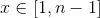
  - Public: 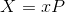
  - Send this to Bob
  - 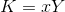
- Bob: 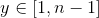
  - Public: 
  - Send this to Bob
  - 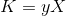
- **Problem**: This is open to an intruder in the middle attack

### Authenticated
- Each party signs the points they exchange (ex. with their RSA private key)
- The reciever verifies the point user the senders public key
-  is signed by Alice
  - In practice this is typically only one way, you can't expect users to manage certificates.
  - So Alice would verify the point recieved by Bob.
-  is signed by Bob

## RSA Key Transport
- Alice select session key k, Alice encrypts k with Bob's RSA public key.
- Why use ECDH over this?
  - Google example
  - ECDH provides **forward secrecy**:
    - If an attacker obtains a ciphertext, then later gains access to Bob's private key, they can decrypt the ciphertexts
    - Uncover the session key k, get the plaintexts that were encrypted with k
    - Giving up a private key (which is in use for a fairly long period of time, +1 year), allows for the decryption of a long term of data. Getting this out would be bad.
    - Using unique RSA keys is expensive, it is easy to pick a random point on the curve.
  - Once the keys are exchanged, at the end of the session both parties should delete their points (y and x) and the shared secret K.
    - This provides forward secrecy
    - If the NSA comes to Google, demanding the private key, they don't have it, meaning any captured ciphertexts can't be decrypted.

## ECDSA: Elliptic Curve Digital Signature Algorithm
- Same EC public params as before

### Key generation:

Each user does the following
1. Select 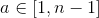
2. Compute 
3. a is Alice's private key, A is Alice's public key
  - Recall the security of this relies on the ECDLP

### Signature Generation

To sign a message of any length
1. Compute 
2. Selects a random secret k (**per-message secret**), 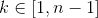
  - **THIS IS VERY IMPORTANT**
3. Compute the corresponding point 
  - You want to extract a number from this point
  - 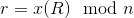. Take the x coordinate mod n of R.
  - If 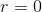 then go back to step 2
4. Compute the ECDSA signing equation: 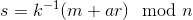
  - Goal is to compute a number that can only be generated using the message key and the private key
  - Recall that n is prime, 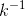 must exist because it is non-zero.
  - If 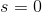, go back to 2.
5. Alice's signature on M is 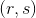

We want 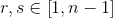

### Signature Verification

To verify 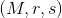, Bob does the following:
1. Obtain an authenticate copy of Alice's public key
  - Through a CA, etc
2. Check that 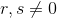
  - If r was 0 then, the signature would not depend on the private key.
  - If not then **reject**
3. Compute 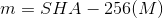
- 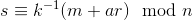
  - Bob can't check this directly, he doesn't know k or a.
  - 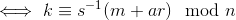
    - This is why 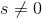, otherwise 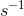 would not exist
  - 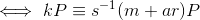, this is because 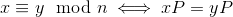
  - 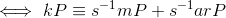
  - 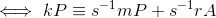
    - Bob can compute the right hand side of the equation using the information he knows.
    - Recall 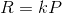
  - 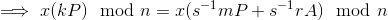
  - 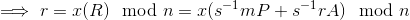
4. Compute 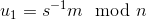 and 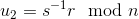
5. Compute 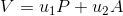 and 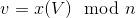
6. Check that 
  - If so, accept
  - If not, reject

#### Notes
1. ECDSA is believed to be secure (existentially unforgable against chosen message attacks)
  - As long as the ECDLP in 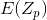 is hard
  - And SHA-256 is a secure hash function.
2. If p is 256-bits (as is the case with P-256), then a signature is 512-bits long
  - Recall that n is roughly p
  - In comparision, an RSA signature with a 3072-bit modulous.
3. Recall RSA signature generation is slower than ECDAS signature generation
  - Since 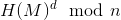 is with a 3072-bit d and n.
  - In contrast, in computing , k is a 256-bit number, as are the coordinates of 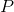. So the arithmetic is with 256 bit numbers.
