# Lecture 32 - March 23, 2018

## Quantum Computers
- We know algorithms (Shor) to solve the following public schemes
  - RSA
  - DL
  - ECC
- For symmetric keys, the best is only 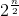
  - Pick 256-bits, then your good

No one knows when quantum computers will become viable to be a true threat.
- How soon do you start to deploy solutions?
  - NSA transition to quantum resistant algorithms (no specified timeline).
    - Current Algorithms
      - Suite B: Unclassified data, sensitive but unclassified data, classified data
        - 2005
          - Public key: ECC, ECDH, ECDSA
          - Security Level: P-256: 128, P-384: 192
          - Hash Functions: SHA-256, SHA-384
          - Symmetric Key: AES-128, AES-256
        - 2010
          - RSA was added: Bit length 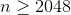
            - Smaller n picked for efficiency
          - But ECC is preferred
        - 2015
          - RSA -> ECC -> Quantum Safe
          - They recommended waiting to switch to Quantum Safe when they became available (if your on RSA)
            - They likely did this to prepare for Quantum computers (whenever they happen)
          - Drop P-256
          - Increased the RSA n bitlength to 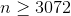
      - Suite A: Top Secret Data

### Quantum Safe Candidates

#### Hash Based Signature Schemes: Lamport-Diffie One time Signature Scheme
- 1979

Ingredients:
- 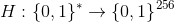 CR Hash function
- 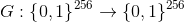 PR Hash function

Key generation: Alices does
1. Select 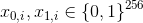, 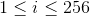
2. Compute 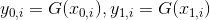, 
3. Public Key: 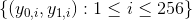, Private Key: 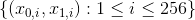

Signature Generation: To sign a message 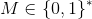
1. Compute , call the bits of h: 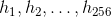
2. Let 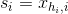, 
3. Then the signature on the message M is, 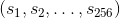

Signature Verification: Given 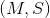 Bob does:
1. Bob obtains an authenticated copy of Bob's public key (recall: A vector of the y string pairs)
2. Compute 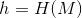, As before call the bits of h: 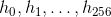
3. Compute 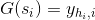, for each i in 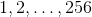

In order to forge the signature, you would have to compute pre-images of G, which is in feasible as it is Preimage Resistance.

##### Notes
1. Each signature reveals half of the private key, therefore given enough captured signatures, an attacker can obtain the entire private key
  - Implication: Ideally you only use the key once.
  - **This is a one-time signature scheme**
  - Not Ideal
  - Can be alivieated using Merkel Trees
2. The signature is long
  - It is made up of 256 256-bit strings
3. Need lots of random bits (when generating the private key)
  - If it is not random, then problems
4. Public Keys are also large (256 256-bit strings), 
5. Private keys are large, 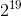

##### Why is it secure (Classically)?
- You have a signed message, thus half of the private key is revealed
- Recall that G is preimage resistant, therefore it is infeasible to find the keys
- Recall that H is collision resistant, therefore it is infeasible to find hash values that are the same
