# Lecture 34 - March 28, 2018

## Lamport-Diffie (LD) One-time Signature Scheme
- The public key should only used to sign a single message, as half of the private key bits are exposed each time.

### Scheme
- Alice's private key: 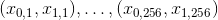
  - Each 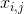 is 256-bits
  - 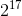 bits in total
- Alice's public key: 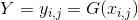

To sign , Alice does:
- Compute 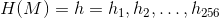
  - note that H is collision resistant
- Signature is: 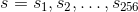
  - where: 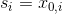 if 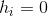
  - 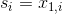 if 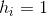

### Security
The Adversary is given public key  and a signed message 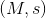 for *one* message of the adversary's choosing. It's goal is to compute a valid signed message: 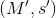 where 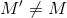

Suppose the adversary can compute  efficiently.
- If 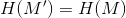, then you have found a collision for 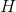. But H is collision resistant, a contradiction.
- If 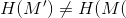, then 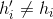 for some 
  - WLOG, suppose 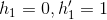. The adversary knows 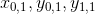. Then the adversary must have computed a preimage of ,  where , but G is preimage resistant. A contradiction.
  - **Note**: 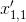 may not be equal to 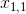, as long as the hash value is the same the scheme will work.

### Facts
- The cheapest (classical or quantum) algorithm known for finding collisions of H is VW.
  - There is a faster quantum algorithm, but the massive space requirements make it not practical.
- The fastest/cheapest (classical or quantum) algorithm known for finding preimages of G is **Grover's Search**, in time  quantum time (operations).
  - Note that the fastest classical would be 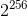 (brute force)

### Drawbacks of the scheme
- Very large keys
- can only use the keys once, very hard to manage in practice.

### Fixing the Key Problem (Merkle's authentication trees)
- **Goal**: Make available large amounts of public data in a verifiable way.
- Pick a power of two public keys, 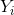
- Build a binary tree, with the number of leaf nodes equal to the number of public keys
- each leaf node has a hash value corresponding to the hash of the public key
- The hash of each parent is equal to the hash of the concatentation of it's children.
- The root value is Alice's new public key.

Suppose Alice signs a message wth her 5th key pair.
- Assume that Bob has an authenticated copy of R (through Certs, or embedded in browser)
- Bob now needs an authentic copy of 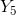, he obtains this by obtaining it from an untrusted public source.
  - Bob also needs the public keys belonging to the sister nodes, draw a path from the leaf to the roof, fill in the dependencies.
- Bob obtains 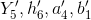 and computes 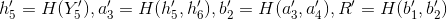
- Check that 
  - Recall that H is collision resistant, then if 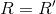 it must be the real R, otherwise you would have found a collision.
- There for the authenticity of 

In general, to make  LD keys available, the tree has height 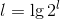. And so one obtains authentic copies of a public key  by performing  hash computations.
- This gives you
