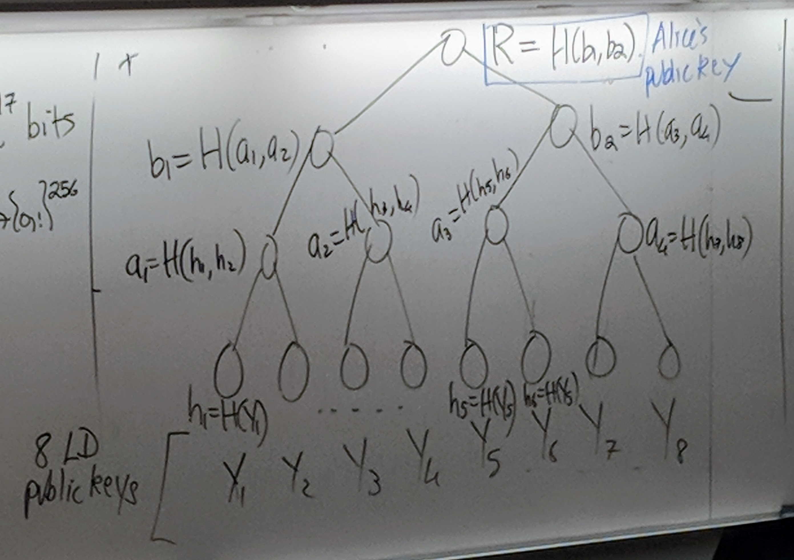

# Lecture 34 - March 28, 2018

## Lamport-Diffie (LD) One-time Signature Scheme
- The public key should only used to sign a single message, as half of the private key bits are exposed each time.

### Scheme
- Alice's private key: $$(x_{0, 1}, x_{1, 1}), \ldots, (x_{0, 256}, x_{1, 256})$$
  - Each $$x_{i, j}$$ is 256-bits
  - $$2^{17}$$ bits in total
- Alice's public key: $$Y = y_{i, j} = G(x_{i, j})$$

To sign $$M \in \left\{0, 1\right\}^*$$, Alice does:
- Compute $$H(M) = h = h_1, h_2, \ldots, h_{256}$$
  - note that H is collision resistant
- Signature is: $$s = s_1, s_2, \ldots, s_{256}$$
  - where: $$s_i = x_{0, i}$$ if $$h_i = 0$$
  - $$s_i = x_{1, i}$$ if $$h_i = 1$$

### Security
The Adversary is given public key $$Y$$ and a signed message $$(M, s)$$ for *one* message of the adversary's choosing. It's goal is to compute a valid signed message: $$(M', s')$$ where $$M' \neq M$$

Suppose the adversary can compute $$(M', s')$$ efficiently.
- If $$H(M') = H(M)$$, then you have found a collision for $$H$$. But H is collision resistant, a contradiction.
- If $$H(M') \neq H(M($$, then $$h_i' \neq h_i$$ for some $$1 \le i \le 256$$
  - WLOG, suppose $$h_1 = 0, h_1' = 1$$. The adversary knows $$x_{0, 1}, y_{0, 1}, y_{1, 1}$$. Then the adversary must have computed a preimage of $$G$$, $$x_{1, 1}'$$ where $$G(x_{1, 1}') = y_{1, 1}$$, but G is preimage resistant. A contradiction.
  - **Note**: $$x_{1, 1}'$$ may not be equal to $$x_{1, 1}$$, as long as the hash value is the same the scheme will work.

### Facts
- The cheapest (classical or quantum) algorithm known for finding collisions of H is VW.
  - There is a faster quantum algorithm, but the massive space requirements make it not practical.
- The fastest/cheapest (classical or quantum) algorithm known for finding preimages of G is **Grover's Search**, in time $$\approx 2^{128}$$ quantum time (operations).
  - Note that the fastest classical would be $$2^{256}$$ (brute force)

### Drawbacks of the scheme
- Very large keys
- can only use the keys once, very hard to manage in practice.

### Fixing the Key Problem (Merkle's authentication trees)
- **Goal**: Make available large amounts of public data in a verifiable way.
- Pick a power of two public keys, $$Y_i$$
- Build a binary tree, with the number of leaf nodes equal to the number of public keys
- each leaf node has a hash value corresponding to the hash of the public key
- The hash of each parent is equal to the hash of the concatentation of it's children.
- The root value is Alice's new public key.

Suppose Alice signs a message wth her 5th key pair.
- Assume that Bob has an authenticated copy of R (through Certs, or embedded in browser)
- Bob now needs an authentic copy of $$Y_5$$, he obtains this by obtaining it from an untrusted public source.
  - Bob also needs the public keys belonging to the sister nodes, draw a path from the leaf to the roof, fill in the dependencies.
- Bob obtains $$Y_5', h_6', a_4', b_1'$$ and computes $$h_5' = H(Y_5'), a_3' = H(h_5', h_6'), b_2' = H(a_3', a_4'), R' = H(b_1', b_2')$$
- Check that $$R = R'$$
  - Recall that H is collision resistant, then if $$R = R'$$ it must be the real R, otherwise you would have found a collision.
- There for the authenticity of $$Y_5$$

In general, to make $$2^l$$ LD keys available, the tree has height $$l = \lg{2^l}$$. And so one obtains authentic copies of a public key $$Y_i$$ by performing $$l$$ hash computations.
- This gives you
