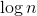
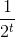
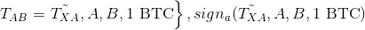

# Lecture 35 - April 2, 2018

## Hash Based Signature Schemes
- recall the lamport-diffie, safe against classical and quantum attacks.
  - Relies on preimage resistance of one hash function, collision resistance of the other
- Problem: Can only use each key once
- Merkle Authentication tree
  - give the roots
  - leaves are public keys
  - to verify a particular public key, need to obtain  other hash values

## Bitcoin
- final exam: very light coverage, if any
- Main practical takeaway from bitcoin: invention of blockchain

### Paper Cash
- Cash issued by a central bank according to some economic policy
- Bob can examine the bill to make sure it's valid, not a forgery
- Alice can't double spend currency, once the physical currency is given away, it's gone.
- Alice doesn't have to identify herself to Bob when making the transaction (payer anonymity), After transaction as well.

### Bitcoin
- goal was attempting to mimic paper cash in the digital world
- decentralized, no central authority
- miners create coins
- everyone on the network regulates the creation of coins
- The majority of all bitcoins that will exist, have been created

#### Why use bitcoin
- decentralized
  - good if you don't trust governments or large financial instituations
- irreversible
- transaction fees are supposed to be low

#### Elements of Bitcoin
1. transactions: transfer of a coin from one user to another, all transactions are public
2. peer-to-peer network: all users organized
3. Blocks: transactions collected into blocks every 10 minutes (on average).
4. blockchain: list of blocks is a blockchain, hash of previous block is included in the next block. Contains a record of all past transactions
  - immutable, can't change a block without changing it's hash value.
  - Recall: SHA-256 is collision resistant
  - Append-only
5. Mining: process of verifying a transactions and compiling a block.
6. Proof-of-work: the miner has to solve a cryptographic challenge.
  - A block has a counter, increment and hash until the hash has a certain number of zeros
    - note that the probability of starting with t zeros is 
  - If you can find a way to cleverly find the hash, can win.
  - Point is to make it difficult to mine
  - Anyone can easily verify (by hashing with the proper counter) that the work was completed by the miner.

#### Main crypto ingredients
- SHA-256 hash function
- ECDSA
  - Each user selects private key , public key 
    - Note that public key is what is included in a transaction
  - A user can select a different public and private key pair for each transaction, gives users a high degree of anon.

#### Transactions
- transfer of a coin from one user to another
- 
  - Alice communicates a signed transaction
  - Anyone can verify (using ECDSA)
