# Lecture 5 - January 12

## Feistel Ladder
- 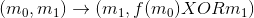

### Chosen plaintext attack on NDS
**Scenario**: Alice and Bob share the secret key *k*
**Adversary's goal: Find *k*

**Adversary's capabilities:**
- Knows everything about the NDS (i.e. the algo), except for *k*
- Has an encryption oracle (wrt *k*)

**Main Observation:**
Let  denote one round of encryption (wrt *k*), so 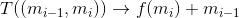

Let 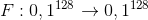 denote the enryption function (i.e. all 16 rounds), meaning 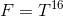

Then for all m 128-bit strings, we have:

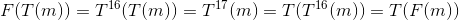
Therefore, we have the communitive property.

**Attack**:
Fix a byte r, we'll determine 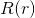 as follows.
Select  such that:
  1. 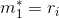: First bit in every byte in 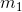
  2. 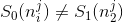 for each j, 1 <= j <= 8.
Next, encrypt u (by asking the oracle) and recieve the ciphertext, 

**Note**: 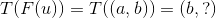, we can't know the right half, since we can't do the encryption ourselves.
Hence, 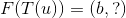

Now, let's guess that , where *t* is a byte.
Apply one round of encryption to u, assuming that *t* was guessed correctly. Call the result 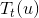
To check the guess, obtain the encryption  from the oracle: .
- If the guess was correct: then 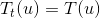, so 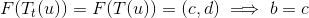
- If the guess was incorrect: Then 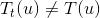 (by condition of selecting *u* above)

Hence, if we make the heuristic assumption that: F behaves like a random function, the probability that the left half (c) of  equals the left half of  is 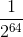, which is neglidgibly small.
- If , then 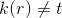
- If 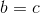, then  with high probability.

Summary:
For each 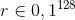 for the following
  - Select  such that the conditions above are true
  - Obtain  from Alice
  - For each byte t do:
    - Compute , obtain 
    - If , then
      - 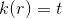
      - goto the next r.
    - If , then
      - goto next r

Analysis:
- The number of chosen plaintexts is at most 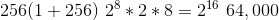 iterations
- Note that this is a feasible number of iterations.

**Assignment 2: Is an MDS-like toy cipher.**
