# Lecture 6 - January 15, 2018

## New Data Seal (NDS)

### Chosen Plaintext Attack (continued from lecture 5)
- Find the table *k* (mapping of values between 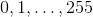 to function values)

Foreach $$r \epsilon {0, 1}^8 do:
- Pick *u* and obtain 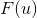
- For each possible byte *t*, check if 
  - obtain the encryption 
  - Check if the guess is correct (i.e. )

Note that the total number of chosen plaintexts is 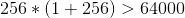
- Alternatevly, the expected number of chosen plaintexts is 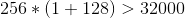, in this case randomly guess *t*'s, on average you'll need to guess half of them.
- **Excercise**: Modify the attack so that the number of chosen plaintexts is 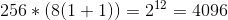. This approach check each bit of *t*.
  - Make reasonable assumptions about  (substitution functions)
- **Harder Excercise**: Reduce this to 556 chosen plaintexts.

Is this feasible?
- Note that Alice and Bob probably aren't real people, think devices.
- Try to get a secret key off of someone's computer, automate the generation of ciphertexts.

## Data Encryption Standard (DES)
- Designed by IBM mid-70's
- US government and banking standard.
- Falling out of use.
- 16-round Feistel ladder.
  - Made use of subkeys, each round in the ladder uses a different key.
  - Avoids the attack of NDS.
- Designed with hardware in mind.

### Problem 1
The key size is too small (only 56-bits).

### Problem 2
The block size is too small.
- Example: Imagine encrypting a large file, on average collisions will occur after about 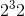 blocks.
  - An attacker can examine the blocks and look for repeats.

### Sophisticated Attacks on DES

1. Differential Cryptanalysis
  - Not practical because of key rotation, would be able to obtain enough `(m, c)` pairs
2. Linear Cryptanalysis
  - Requires fewer `(m, c)` pairs.
  - Key rotation still a problem

## Multiple Encrpytion
- Since DES was implemented in hardware, it made it more difficult to switch away from.
- Goal was to find a way to use DES, without upgrading hardware.
- Solution: Re-Encrypt ciphertext one or more times. Hope that this increases the effective key length.
- Doesn't always result in a better ciphertext.

## Double DES
- Run DES twice, with 2 keys.
- 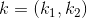, 2 56-bit keys.
- Encryption: 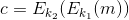
- Decryption: 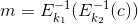

### Problem: Meet in the middle attack

Generate a guesses 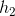 for 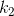, apply 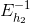 to *c*, Store them in a table.
Do the same for 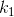, see if there are any matching pairs. For each match, compare to the other pairs.
- If it is a match for both, then it is a match with high probability.
- If not, then it is not a match.
