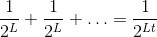
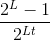
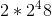
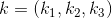

# Lecture 7 - January 17, 2018

## Double DES
- Expensive to upgrade hardware
- Want to use DES, but can it be more secure?
- Repeat DES multiple times with seperate keys.
- But, even though the effective key length is 112 bits, it is possible to break with a meet in the middle attack.

### Number of PT, CT pairs needed
- We want to select the smallest possible *t*, of PT/CT pairs, such that we can determine the key k with high probability.
- The probability the k encrypts the other pairs: 
- The number of false keys: 
  - Keys in the key space, different then the secret, that encrypt all of our known pairs
  - false positives.
  - Want to pick *t* such that this is close to 0.

### Analysis of the attack
1a. 
2a. 
2c. Note the two des operations: 
- In reality, Requires an exabyte of storage, not practical.
- Can trade off memory for time, to make it more feasible.
- **Assignment 2**
- Double-DES has the same effective key length, as attacks on both systems take roughly the same amount of time.

## Triple DES
- 
- 168-bit key, effectivly 112-bit because of known attacks.

## The Advanced Encryption Stanard (AES)
- An actually useful block cipher.
- Designed to replace DES, triple DES
- No attacks have been found
- Use round keys h round keys, XOR with A, substitution, permutation.
- **Key point**: All options happen on bytes inorder to make software implementation easier.

### How to encrypt longer messages?
Break up the long plaintext into 128-bit blocks. encrypt each

#### Electronic Cookbook Mode (ECB)
Encrypt blocks independently, one at a time, using the secret key.
- Problem: a plaintext block always maps to the same ciphertext block. Chosen plaintext attacks.
- Does not have semantic security.
- Given an oracle, you can try to guess a plaintext block. You can learn something if they do/don't match.
- Note: This doesn't give the secret key.

#### Cipher Block Chaining (CBC) Mode
This solves the deterministic problem, introduce some randomness.
- 
- Introduce a random initialization vector XOR with plaintext block. Feedforward  when encrypting plaintext block .
- Note that the IV is different each time, don't have a way to check that your plaintext was correct.
- Identical plaintexts blocks don't always translate to the same ciphertext blocks.

##### Theorem: CBC Mode is semantially secure against chosen plaintext attacks
- This makes the assumption that the IV is well selected (sufficiently random)
