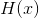
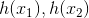
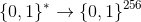
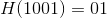
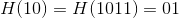
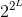

# Lecture 9 - January 22, 2018

## Encryption at Google

### Web pages + servers:
SSL / TLS

### Machines in Datacenters
ATLS: Application TLS

### Data Stored in datacenters
Uses a separate service

#### Key Management Service
- AES256-GCM (Galois Counter Mode)
- Manages Key Encryption Keys
- Physical backup of the Root KMS Master is made incase of system reboot.
  - All other are stored in RAM

## Hash Functions
- Very large maximum input size of  (typically just `*`, because it's so large)
-  can be efficiently computed
- **Note:** The description of a hash function is public, there are no secret keys.
- hash value, hash, message digest

**Goal**: One way, can't reverse
  - collisions should be very hard to find
  - fingerprint (usually a fixed length)
  - , should have no relation between them

### SHA-256

### Davies Meyer Hash function (from block ciphers)

-  be an m-bit block chiper with n-bit key k
- IV be a fixed m-bit initializing value
- Break up  into m-sized blocks. (append 1 to the end and then pad with 0's)
- 
- Use each message block as the "key", feed though all blocks

## Properties
- , `1001` is a **preimage** of `01`
- **second preimage**: , `10` is a **second preimage** of 01

### Preimage Resistance
Given a hash y, It should be computationally infeasible to find an x such that .
- Should have non-negligible probability of success.
- With a large bit-length, this should be very small (i.e. unlikely to randomly guess)

### Second Preimage Resistance
Given a message x, it is computationally infeasible to find a second input x` (`x != x'`) such that the hashes are the same.

#### Modigication Detection Codes (MDCs)
To ensure that a message is not modified in a malicious way, compute the hash of the message and protects H(m) from un-authorized modification
- Virus protection
- Validating software / files
- Requires second preimage resistance

### Collision Resistance
Computationally infeasible to find 2 distinct inputs, such that their hashes match.
- Trade off between hash computation time and probability of finding a collision.

#### Message Digests for digital signature schemes
- Instead of signing the actual message, sign the digest (more efficient)
- Message space huge (), but smaller hash space ()
- requires all forms of resistance

### Relationships
**Note:** When proving these relationships, prove the contrapositive

1. Collision resistance implies 2nd preimage resistance
2. 2nd preimage resistance does not guarantee collision resistance
  - : Not Collision resistanct because of (0, 1)
  - : Is 2nd preimage resistant,
  - Collision resistance is harder to guarantee.
3. Collision resistance does not guarantee preimage resistance.
  - : Is collision resistant: All n-bit x's have unique hash values, all other x's are in the second case, which depends on `H`.
  - Not preimage-resistant because preimages can be easily found for (at least) half of all possible.
    - If the hash starts with a 1, simply guess the n-bits after the 1.
4. Collision Resistance implies preimage resistance **(in practice)**
  - Real hash functions are designed to be reasonably uniform
  - Low probability of guessing
  - If it's not preimage resistance, there are many pre-images that can be found thus `(x, x')` is a collision (not collision resistant)

