# Midterm Notes

## Fundamental goals of Crypto

1. Confidentiality: Keep data secret from all but those who are authorized to access it.
2. Data integrity: Ensuring data has not been altered by unauthorized parties.
3. Data Origin Authentication: Corroborating the source of data
4. Non-Repudiation: Preventing an entity from denying previous actions or commitments

## Attacks

### Assumptions of Adversary

- Information theoretic security: The adversary has infinite computational resources
- Complexity-theoretic security: The adversary has a "polynomial time turing machine"
- Computational Security: The adversary has 10,000 Intel Xeon CPUs.

### Goal of the Adversary

1. Recover the secret key
2. Systematically uncover plaintext from ciphertexts
  - May not actually need/have the secret key to accomplish this.
3. Learn some partial information about the plaintext (other than it's length)

If an adversary can achieve **1 or 2**, then the encryption scheme is said to be totally insecure.

If the adversary cannot learn any partial information about the plaintext from the ciphertext, then the encryption scheme is said to be semantically secure.

### Passive

- Ciphertext only attack: The adversary knows some cipher text
- Known plaintext attack: The adversary knows some plaintext, ciphertext pairs.

### Active

- The adversary can choose some plaintexts to be encrypted and obtain the ciphertext (via some oracle).

## Symmetric Key Encryption Scheme
- A symmetric key encryption scheme is said to be secure if it is semantically secure against chosen-plaintext attacks by a computationally bounded adversary.

To break a symmetric key encryption scheme, the adversary must accomplish:
1. The adversary is given a challenge ciphertext
2. The adversary can select plaintexts and can obtain the ciphertext from the oracle.
3. After a feasible amount of computation, the adversary obtains some information about the plaintext corresponding to the ciphertext.

### Desirable Properties

1. Efficient algorithms should be known for computing  and 
2. The secret key should be small, but large enough to prevent exhaustive key search.
  - Note that 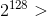 operations is considered infeasible.
3. The encryption scheme should be secure.
4. The scheme should be secure against even the designer of the system.

## Security Levels

A cryptographic scheme is said to have a security level of l bits if the fastest known attack can be performed in  bits.
- A security level of at least 128 bits is desired in practice.

## Stream Ciphers

Use a pseudorandom bit generator (PRBG) to generate "random" keystream bits.
- The seed for the PRBG is the secret key between Alice and Bob.
- The security depends on the quality of the PRBG

### Security requirements of the PRBG
- The keystream should be indistinguishible from a random sequence (the **indistinguishability requirement**)
- **Unpredictibility Requirement**: Given portions of the keystream, an adversary should not be able to learn anything about the rest of the keystream.

## RC4 Stream Cipher

### Key Scheduling Algorithm

Given the secret key, generate a random looking permutation of 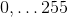.

### Keystream Generator

Given the random permutation (from the scheduler), generate keystream bytes. The keystream bytes are then XOR-ed with plaintext blocks.

## WEP (Wired Equivalent Privacy)

1. Confidentiality: Prevent Eavesdropping
  - RC4 is used for encryption
2. Data Integrity: Prevent tampering with transmitted messages
  - Integriy checksum is used
3. Access control: Protect access to wireless network infrastructure
  - Discard all packets that are not properly encrypted using WEP

The mobile client shares an either 40-bit or 104-bit secret key with the access point. Messages are divided into packets of some fixed length.

Each packet uses a per-packet 24 bit initialization vector, the standard does not specify how IVs are managed
- A random IV is generated for each packet
- The IV starts at 0 and is incremented by 1 for each use (counter)

### Protocol

#### Client side

1. Select 24-bit IV
2. Compute a 32-bit checksum, 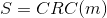
3. Compute 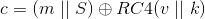
4. Send 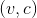 over the wireless channel.

#### Reciever

1. Compute 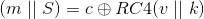
2. Compute 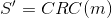, reject packet if 

#### Problems

##### IV Collisions
**WEP doesn't provide a high degree of confidentiality**

There's only  possible IVs, eventually they will be repeated.
- then all encrypted packets contain , can XOR them together, if either plaintext is known the plaintext can be extracted.

By the birthday paradox, if IVs are randomly expected then a collision should be expected after 

##### Linear Checksum
**WEP does not provide data integrity**

It's possible to make controlled changes to encrypted packets, that are still valid.

##### Integrity function is unkeyed
**WEP does not provide access control**

If an attacker can obtain the plaintext of some encrypted packet , then they can compute:
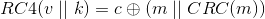
Therefore, the attacker can compute a valid encrypted packet for any message of their choice.

## WPA

- Uses a master key from which 128 bit session keys are periodically generated
- session key combined with 48-bit IV to form the RC4 key.
- A Message Authentication Code (MAC) algorithm is used instead of CRC.

## WPA-2

- Uses AES instead of RC4

## Block Ciphers

A block ciphers is a SKES the breaks of the plaintext into blocks of fixed length and encrypts it one block at a time.
- in Contrast, a stream cipher encrypts the plaintext one bit at a time.

### Desirable Properties of Block Ciphers

#### Security
- Diffusion: each ciphertext bit should depend on all of the plaintext bits
- Confusion: the relationship between key and ciphertext bits should be complicated
- Key length: should be small, but large enough to guard against exhaustive key search.

#### Efficiency
- Simplicity: Easy to implement and analyze
- high encryption and decryption rate
- Suitability for hardware or software

### Feistel Ciphers
- Block length n
- h rounds
- l: key length
- M is 2 blocks
- A key scheduling algorithm is used to determine subkeys for each round.
- **Encryption**: 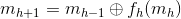
- **Decryption**: 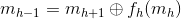

### New Data Seal (NDS)
- n = 64, h = 16
- key maps 8 bits to 8 bits
  -  possible keys
  - 256 slots in the array, each with a value of 256

#### Chosen plaintext attack
- Can obtain the secret key after 32,000 plaintexts
- Try to bruteforce the value for k(r)

### Data Encryption Standard (DES)
- Feistel cipher: n=32, h=16, l=56
- Using the secret key, selects 16 48 bit subkeys
- S-Boxes: Security of DES depends on their choice

#### Problems
- Exhaustive key search is feasible ( steps) and can be easily parallelized
- If plaintext blocks are distributed uniform random, then by birthday paradox the expected number of encrypted blocks before a collision occurs is 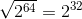

#### Double DES meet in the middle attack
- foreach possible , perform 1 round of DES decryption, save results in a table.
- foreach possible 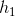, encrypt the plaintext see if the result is in the table
  - IF it is, check the other 2 plaintext, ciphertext pairs
  - IF not, it's not correct, move on.

### Electronic Cookbook Mode (ECB)
- Encrypt blocks independently, one at a time
- 
- **Problem**: IDentical plaintext blocks produce identical ciphertext blocks.

### Cipher Block Chaining Mode (CBC)
- 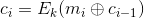
-  is a random non-secret IV.
- Each ciphertext block feeds into the next.

## Hash Functions
- Map inputs of arbitrary bit length to a fixed length, n.
- H can be efficiently computed for any length

### Properties of Hash functions

#### Preimage resistance
- Given a hash value y, it is not computationally feasible to find an x such that 
- x is called a preimage of y
- **Application**: Password protected systems, store (user id, H(password)) in db.

#### 2nd Preimage Resistance
- Given an input x (and it's hash value), it is computationally infeasible to find an 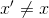 such that 
- **Application**: Modification detection codes, prevent a message m from being modified by unauthorized means.

#### Collision Resistance
- It is computationally infeasible to find two distinct inputs  such that 
- **Application**: Message digests for digital signature schemes, if collisions exist, Alice could sign x but actually send x'.

#### Relationships between properties

Collision resistance implies 2nd preimage resistance
- Proof: Suppose H is not 2nd preimage resistant. Then, given an input x it is computationally feasible to find a distinct input x' such that .
  - (x, x') is a collision, meaning H is not Collision resistant.
  - Therefore, if H is collision resistant, then it is 2nd preimage resistant.

2nd preimage resistance does not guarantee Collision resistance.
- Proof: Hash function where H(1) = H(0), can't find 2nd preimage given (potentially any) x, but easy to find a collision.

Collision Resistance does not guarantee preimage resistance.

### Hash Function Terminology

- A preimage resistant hash function is called a One Way Hash Function (OWHF)
- A hash function that is both preimage resistant and collision resistant is called **a cryptographic hash function**

### Generic Attacks on Hash functions
- A generic attack does not exploit the properties of any particular hash function
- For analysis purposes, H is viewed as a random function (however this isn't the case in practice)

#### Generic attack to find preimages
- Given a hash value y, select arbitrary inputs x until 
- Brute force
- Expected number of hash evaluations: 
- **This is the optimal generic attack for finding preimages**

#### Generic Attack to find Collisions
- Select arbitrary inputs x, insert into a table  (sorted by the hash value)
- Repeat until you find x' such that  is in the table, with a distinct x.
- Expected number of evaluations 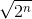, by birthday paradox.
  - Expected space requirements is 
- This attack is infeasible if 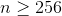
- This attack is optimal in terms of hash function evaluations.

#### VW Parallel Collision Search
This attack is easily parallizable and can be modified to find meaningful collisions.

- A more efficient implementation of the generic birthday attack, hash neglidible space requirements.
- Only need to store **distinguished points**, points with some easily testable property.
  - ex. A point is distinguished if the 32 most significant bits are 0s.
- Compute the sequence of hash values, store the distinguished points in a table
- If you see the same distinguished point again, you know that you have found a loop in the sequence from values b to d.
- Compute hash values forward from b, backward from d until the collision is found

##### Parallizable
- Can be computed in parallel
- Each thread has a different starting point in the sequence
- When results are combined, if a distinguished point has already been seen then the collision exists.

### Davies-Meyer (Based on Block Ciphers)
- m-bit block size
- Break up 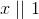 into t m-bit blocks (pad with 0s)
- 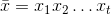
- 
- 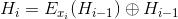
- 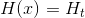

### Iterated Hash Function (Merkel Meta-Method)
- n-bit IV
- n+r-bit -> n-bit compression function.
- break up x into t r-bit blocks
  - 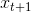 is defined to be a length block
- 
-  for i > 0
- 
- **Theorem**: If the compression function is collision resistant, then the hash function is collision resistant.

## Message Authentication Schemes
MAC schemes are a family of functions , with an l-bit secret key k.
- Can be efficiently computed
- Used for providing data integrity and data origin authenticity
  - Note: May not provide, confidentiality of the message or non-repudiation.

### Security Definition
- Let k be shared key
- The adversary does not know the key, but can obtain message signatures from Alice or Bob.
- **Goal**: Obtain the signature for any new message, i.e. not signed by Alice or Bob.
- A MAC scheme is secure if given some MAC tags it is computationally infeasible to compute a message tag pair for any new message x.
  - Must existentially unforgebale from chosen message attacks
  - If secure, a MAC scheme can provide data integrity and data origin authentication.

### Generic Attacks on MAC Schemes

#### Random Guessing
- Select a y and guess that 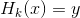
- If random function, then probability that it's correct is: 

#### Exhaustive Search on the Key Space
- Given r known message-tag pairs
- Can guess values for k, check if 

### MAC based on Block Ciphers

#### CBC-MAC
- Divide x into r n-bit blocks
- 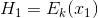
-  for 2 <= i <= r
- 
- **Theorem**: Sps E is an ideal encryption scheme (each result is "random"), then CBC-MAC with fixed length inputs is secure.
  - If variable length inputs, then chosen message attack is possible.

#### Encrypted CBC-MAC (EMAC)
- CBC-MAC, but encrypt the last block under a different key.
- 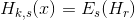
- If E is an ideal encryption scheme, then it is secure for inputs of any length.

### MACs based on Hash functions
- Let H be an iterated hash function
- let compression function f map n+r bits to n-bits
- Let the key be padded with 0s (to be bit-length r)

#### Secret Prefix Method
- 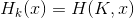
- Possible to perform a length extension attack, can compute the tag of 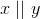 by retrieving , then continue to compute the hash function. No knowledge of k required.

#### Secret Suffix Method
- 
- Secret prefix attack doesn't work here
- If H is not collision resistant, then it is possible to find a collision 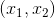, then 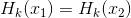

#### Envelope Method
- 
- Seems to be secure

#### HMAC
- 
- Relies on compression function, secret IV to be secure.

### Authenticated Encryption
- Encryption scheme provides confidentiality
- A MAC scheme provides authentication (data origin authentication and data integrity)

#### Encrypt - AND - MAC
- Alice sends 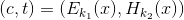 to Bob
- Bob decrypts c and checks that the signature is correct
- Problem: H may leak information about the plaintext, no confidentiality requirement.

#### Encrypt-Then-MAC
- Alice sends  to Bob.
- Bob first checks the signature of the ciphertext, then decrypts if it matches

#### AES-GCM
- Can have header information that is authenticated, but not confidential.

### Public Key Crypto
- Symmetric key crypto requires sharing a secret key over some secure channel
  - The key must get to Bob without anyone else gaining access.
  - Bob and Alice must both keep the key safe
- Key management problem
  - In a network of n users, they must hold n-1 keys
  - Total number of secret keys: n choose 2 = 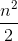
