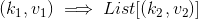
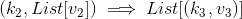
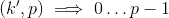

# Lecture 1 - January 4, 2018

### Data-Intensive Task

- Process 10B web pages
- **Data Parallel**: Lots of data processing at the same time.

### Compute-Intensive Task
Complex nuclear simulation, solving differential equations

### Coarse-Grained parallelism
- 1000 threads each do 1 thing
- Don't talk during processing
- Combine at the end

### Fine-Grained
- 1000 threads
- message passing, interrupts

### Logical Design

A logical design can be manephested by potentially many physical designs. High level.

- Scheduling: workers, work slots -. how to do this
- Operators: Sort
- Data Models: A schema

### Physical Design

Physical manepestation of how it actually happends

- Scheduling: How do we allocate threads
- Operators: QuickSort
- Data Models: What are the actual data types, how is it implemented?

## Rooted in Functional Programming

Higher order functions give the tools to describe.

### Map
- Apply some function to every record in a collection.
- This is good enough for simple parallel problems (Course)
- Can't do more complex things like message passing.

### Fold
- Given some function  and an initial value, applies  to each value in the collection, get a result in the end.
- "Aggregate intermediate results"
- Right and Left Fold.
- Example: Aggregate a list (sum).

```scala
// Compute a sum of squares, using map and fold
val t = Array(1, 2, 3, 4, 5)
t.map(n => n * n).foldLeft(0)((m, n) => m + n)
```

## MapReduce
Programmer specifies 2 functions, note that each object has some unique id.
Every object with the same key goes to the same **reducer**.
Perform a distributed group-by (the slowest operation - bottleneck, need to move things across the network).

1. **map**: 
2. **reduce**: 
  - **Important**: Reducers process keys in sorted order.
3. **partition**: 
4. **combine**: 

### Example
- Want to compute a frequency count of all words in some text.
- map: iterate over all words, `emit(word, 1)`
- reduce: keys are words, lists are counts, emit length of the list.

### MapReduce Runtime
The framework handles everything else:
- Scheduling: Assigning workers to map and reduce tasks
- Data distribution
- Synchronization
- Errors and fault tolerance.
- Distributed filesystem
