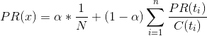
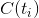
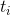
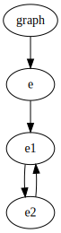
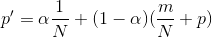

# Lecture 10 - February 6, 2018

## Parallel BFS: Review
- Take adjacency list approach
- Distance to yourself
  - you need to do this so you can have awareness of the source
  - There might not be a way to get to the source
- Group By
  - Nodes that you can reach along the path
- Reduce
  - Selects the minimum distance path
  - with additional book-keeping can keep track of the path
- **Need to keep track of the graph structure**

### Implementation Details
- Driver class
- Sets up MapReduce jobs
- expands the frontier by 1
- job writes back to HDFS
- Perform convergence check to see if another job needs to be enqueued

### Application: Social Search
- How can you rank friends named "John"?
  - Easy way is to sort by the distance

#### How?
- Naive implementation
  - **Precompute all distances for all pairs**
    - **BAD**: Most likely impossible at scale
  - **Compute distance at query time**
    - When someone makes a query, compute the result
    - Too slow to support
- Take inspiration for all paths (Floyd warshall)
  - have n source nodes
  - Perform parallel BFS, emit array of distances wrt each source
  - Reducer select minimum in each array
  - scale?
    - Practial number of source nodes will be much less than the total number of verticies.
  - **But**: It allows you to make inferences to approximate the distance

##### Landmarks
- Select n "landmark" / seeds nodes
- Compute the distances from all nodes to all landmarks / seeds
- Martix of size: \# of verticies * \# of seeds
- Maximum distance between nodes can be expressed in terms of the distances to the landmarks
  - Gives upper bound on the true distance
- Varying strategies for choosing the landmarks and how many

## PageRank
- Google's original secret sauce.
- "Page": Larry Page, not Web Page
- "Random Surfer Model"
  - randomly clicking on links
  - random monkey theorem
- Gives a probability distribution over time spent on pages

### Intuition
- You get high PageRank value, by having lots of in bound links
- Higher if those in-bound links also have high PageRank
- Basically models popularity

### Definition
- 
  - Sum of the proportional PageRank masses
  -  number of out-going edges for 
- : "Random teleportation factor"
  - With probability , teleport to a random page
  - Otherwise, click on random links

### Algorithm
- Start with seed PageRank nodes
- each page distributes it's PR mass to all other nodes

#### Simplified Algorithm
- No random jump factor
  - If there is a dangling cycle, whatever little PageRank mass is at the edge will enter the loop, then cascade.

- No dangling nodes
  - No outgoing edges
  - PageRank mass that gets accumulated will disappear
- Iterate until the values don't change anymore / convergence.

#### Complete PageRank
- Handle dangling node
- random jumps
- Solution: Perform a second pass, update your pagerank value
- 
  - Need to account for the random jump factor
  - m: missing PAgeRank mass
    - Gets accumulated at the edges
    - redistribute

##### Implementation
- 2 MapReduce Jobs
- MapReduce: random walk
- Map job: redistribute mass
  - What is the missing mass?
    - Look at the output from the previous job
- Check for convergence

##### Optimization: Single MR job
- Fold the second Map only job into the Mapper of the next iteration
- **Note**: Still have to do it at the very end

#### Convergence Check
A few options
1. Fixed number of iterations
2. compute some sort of error / delta between PageRank values
3. The PageRank rankings / order of the nodes don't change

##### Web Graphs
- Can't be truely answered
- Lots of spam, SEO
  - Create lots of noise in the data
- "Infinite Calendar Problem"
  - Imagine a dynamically generated calendar
  - All pages have a "Next Month" link
  - Infinite chain.

## Log Probability
- Web graphs have billions of verticies
- PageRank probability values are really small
- Defeat floating point precision issues with decimals

## Extracting the WebGraph
- Integerize the URLs
- First pass build a dictionary of URLs
- build the adjacency list, sub in the id

## Variations

### Weighted Edges
- Instead of even distribution of

### Personalized PageRank
- Same analogy as single source vs. multi source shortest path
- Personalizing the ranking wrt a source node.
  - Specify the source node: what your personalizing for
  - all PageRank mass that comes from teleportation comes back to the source node
    - i.e. always teleport back to the source
- Implications: Never go too far out of your neighbour hood

#### Multi-Source Personalized PageRank
- Personalized PageRank wrt multiple source nodes.

## Straggler Problem
- Verticies with lots of incoming edges (ex. Google.com, Wikipedia)
- Slow things down.

## Spark
- Need to pass along 2 things
  1. Adjacency List
    - **These NEVER change**
    - Therefore, no need to shuffle them around
    - Cache it
  2. PageRank Mass
- Basically a join, flatMap, reduceByKey
