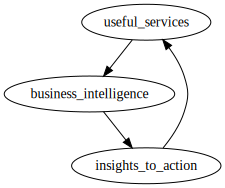

# Lecture 11 - February 8, 2018

## Evolution
- Monoliths
- Front-end / Back-end
- Database
  - Why?: Separation of concerns
  - Before: Some data in memory, some in files, painful
  - Ted Cod: relational Database

### Business Intelligence
- Organization can exploit it's data as an advantage in the market
- analysis, planning, etc

### Database Worloads
- Very different
- way more customers than data scientists

#### Frontend: Online Transaction Processing
- OLTP
- high concurrency, fast, realtime
- Buying tickets, products, etc.
- Relatively small number of transactional queries
- random access (read, update, writes)
  - Each query will modify small numbers of data

#### Analysts: Online Analytical Processing
- Data processing, data mining, business intelligence
- less strict latency requirements, batch processing
- High number of reads
  - full table scans

#### Do Both Together?
- **Bad Idea**
- variable latency
  - Analyist launches big query, OLTP queries effected
- Poor memory management
  - Full table scans will kick very thing out of the cache
- conflicting data access patterns
  - Large reads vs. small writes

#### Solution: Data Warehouse
- Have multiple databases
- Separate datastore to optimize for each workload

##### ETL
- Extract, Transform, Load
- Pipeline OLTP data to data warehouse

##### OLAP Schema: Star Structure
- Organize data around a central **Facts Tables**
  - think sales
- Link dimensions to the facts table
  - Customers, products
- **snowflake**
  - Can denormalize the dimension tables

##### Transformation
- Data cleaning
  - Duplicate data
- integrity checking
  - Do sales match inventory?
- Schema Conversion
  - Convert to stars and snowflakes
- Field transformation
  - OLTP: Dates recorded in local time
  - OLAP: Transform to UTC
  - Add new columns

##### When does ETL happen?
- periodically
- i.e. every night
- **Implication**: Analysts are roughly a day behind

### What do analyists actually do?
- report generation
  - summaries, insights into organizations
  - for business people, faciliate decision making
- dashboards
  - extension of reports
  - realtime reports
- ad-hoc analyses
  - Specific analysis, not included in reports / dashboard
  - on-demand

### OLAP Cubes
- Represent operations on OLAP data in some n-dimensional hypercube

#### Operations
- **Slice and Dice**
  - Slice the cube into areas that your interested in
  - Take a time slice: Only care about last month
- **Roll up / drill down**
  - Dimensions often have heirarichal structure
    - Time is composed of hours, days, years
    - Products: specific categories, sports equipment
  - Going up and down heirarchies
  - Roll-up: Group the stores by region
  - Drill-Down: Stores in Ontario -> Stores in South-western ontario -> Stores in Kitchener
- **Pivot**
  - Rotate the cube
  - Sales figures for products and stores, rotate to see changes by month
  - Perform aggregation along some different aggregations

##### In SQL
- Lots of joins, group-bys and aggregations
- Joins: Build the cube
- group-bys: roll-ups
- aggregation to find what you actually want

##### Challenges
- It's alot of work to have to materialize the cube everytime
- Can we precompute parts of the cube?
- Trade-off time vs. space

### Fast-Forward
- Data got bigger, ETL process took longer.

#### Facebook
- Transitioned from Oracle data warehouse to hadoop

##### ETL -> ELT
- Extract Load Transform
- If the data is too big, it doesn't make sense to transform
- Do the transformation in Hadoop!

###### Why?
- Dropping costs of disks
  - Cheaper to store everything, then deciding what to store
  - You have to pay employees to decide what information to store
- Types of data collected
  - don't only store the obviously valuable information
  - Also behavioural data: What people are doing, where do they go, what do they see?
    - Makes up the vast bulk of data
    - Raw HTTP logs
- Rise of Social media -> User generated content
  - Instead of a few publishers producing content, **everyone is**
- Increasing Maturity of data mining techniques
  - Better ways of learning from data
  - More cool things to do with the data
  - Creates value

### Virtuous Product Cycle

- *hopefully* make money.

### Analytics
- Descriptive analytics
  - OLAP type operations
  - Create some kind of summaries
  - Given all the data, tell me about it
- Predictive analytics
  - Given all of this data, what will people buy next?
  - Forecasting

#### Data Science: Analyze user behaviour
  - Demographic Profiling

#### Data Products: Transform insights into actions
  - Recomendation system

### Why Presto / HIVE?
- SQL implemented in MapReduce jobs
- Scalability: No data warehouse could meet their needs
- Cost: Probably would be very expensive

#### Why Databases
- when data has structure
- Data isn't noisey
- You know the queries you're going to run ahead of time
- **Known Unknowns**: Don't know the answer, but know the question to ask

**Therefore**: Not great for behavioural data
- No idea what you could be looking for, given behavioural data, lots of things
- **Unknown unknown**: Don't know the questions to ask, if there's even anything useful
  - data products
  - predictive analytics
- Hadoop is great for this!
- When you don't know what your looking for, indexes don't help

### Data Lake
- HDFS

