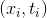
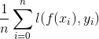
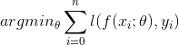
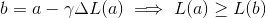
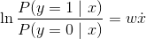
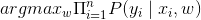
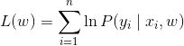
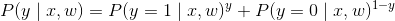

# Lecture 14 - February 27, 2018

## Data Mining

### New Buzzwords!

#### Descriptive Analytics
- Data warehousing
- Cubing operations

#### Predictive Analytics
- Supervised Learning
- Machine Learning

### Supervised Machine Learning
- Goal from the course: Show how it interacts with big data
-  train a model to learn some function
- **Classification**: Descrete Classes
- **Regression**: Predict some continuous value

--------
training_data -> machine_learning_model
machine_learning_model -> training
training -> testing
testing -> deploy model
-------

#### Features
- Objects are typically represented as a set of features
- **Dense Features**: Every instance has the feature
- **Sparse features:** Few instances have the feature
- Features are created with respect to domain knowledge
  - Utilize info learned from descriptive and exploratory analytics
- Highly application specific

#### Components of a ML Solution
1. Data
2. Features
  - Extracted from the data
3. Model
4. Optimization
  - Process of fitting the model

##### Production Systems
- Typically a mix of rule based business logic and ML systems
- Some things are so obvious that you don't want the model to learn
  - i.e. Automatically refute Nazi memorabillia, don't take a chance that the model will get it wrong.

##### Limits of Supervised Classification

You need a lot of **labelled** data. Someone has to label it. But there are ways around it:
- **Crowdsource** the task: pay people to label it for you
- **Bootstrapping, Semi-Supervised**: Generate labels at scale
  - Assume that all tweets with a :happy: emoji have a positive sentiment.
- **Exploit user logs**
  - Recall the virtuous product cycle
  - If a user clicks the first Google search result, then that's an indication that it's a relevant query
    - If they click the second result, then the results weren't very relevant.
  - This creates a winner take all situation
    - Lots of users
    - Lots of data, behavioural data
    - more oppourtunities to exploit

##### Neural Networks
- They've allowed organizations to exploit more data than before.
  - **Data is what powers these networks**
- Unlocked non-linear relationships
  - Learn more fine grained relationships
- No need to do feature engineering
  - For example: Can directly learn features from pixel data

### Supervised Binary Classification
- 2 output classes (positive, negative)
- Form the primitives for multi-class classification
  - Can do 1 vs. rest classification
    - (A or not), (B or not), (C or not), ....
    - Take the most confident
  - Classifier cascades
    - Consult the classifiers in series
    - Is it a tree, is it a flower, etc.
      - Stop when found
    - Very efficient
      - Especially when you have unbalanced classes (ex. way more cats than dogs)
- Loss function: Minimize the error
  - 
  - 
    - Model param  such that the loss is minimized

#### Gradient Descent
- Iteratively minimize the loss using the gradients
- Partial derivative with respect to each underlying dimension
- Take a step in the opposite direction of the gradient in order to reduce
  - 

##### First Order Optimization Technique
- Slow convergence

### Logistic Regression
- Define a weight vector and a threshold
- 1 if w dot x >= t
- 

#### Training
- Maximize the conditional likelihood, note **gradient ascent here**
  - 
- Define: 
- 
- Use log rules to get log likelihood

##### Classifier Update
- Take the derivative of the loss function

#### MapReduce Implementation
- The partial gradient summation can be run in parallel inside the Mappers
- Shuffle all of the results to a single Reducer and apply the update
- Each MapReduce job is 1 update
  - Write the updated model params to HDFS
  - In the driver decide to run another round
  - Iterate until convergence

##### But Hadoop is bad at this
- Bad at iterative algorithms
- Vulnerable to skew
  - Iteration speed is bounded by the slowest mapper
- Potentially poor cluster utilization
  - Have to combine everything together for a single reducer
- Tradeoffs between complexity vs. number of iterations
  - Higher order optimization, more complex, but accurate steps
  - first order: Not complex to compute, but taking non-optimal steps
