# Lecture 16 - March 6, 2018

## Similarity

How similar / close are two items.
- LArge distance = low similarity

### Variants
- Online: Given one, find the most similar
- Offline: Extract all similar pairs of objects from a large collection

### Clustering
- Group all of the similar items together
- **Online**: Given the object one at a time maintain clusters
- **Offline**: Given all items, find clusters

### Everything boils down to 4 steps (online and offline)

1. Define a distance metrick
2. Compute some representation of object (features)
3. Project
4. Extract out the similar items from the projection

#### Distance MEtrics

- Non-Negative
- Identity property
- Invertable 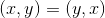
- Triangle inequality

##### Jaccard Similarty
- 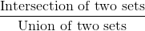
- Overlap

##### Norms
- Euclidean Distance: L2 root of sum of squared differences
- Manhattan: L1

##### Cosine
- Measure the angle between objects (vectors)
- 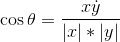

##### Hamming Difference
- Number of different bits

#### Representations

##### TExt
- Unigrams
- n-grams == shingles
  - At word level
  - At character level
- feature weights
  - boolean
  - tf.idf

##### Not Text

###### Recommendation Systems
- Items as features for users
  - Define a user based on the items that they've liked
  - Look at what users have liked, recommend more items
- Users as features for items
  - A Item (ex. movie) is defined in terms of users (ex. the users that have liked it)
  - Look at what users have liked an item

###### Graphs
- Use adjacency list as features for verticies
  - i.e. the features of a vertex are it's neighbours

###### For Log data
- Behaviours
- clicks

#### Project

##### Minhash
- Try to solve near duplicate detection of webpages
  - Mirror pages (legit - lots of wikipedia)
  - Spam farms (non-legit)
  - Might copy, but reskin site (different css)
- Naive alg
  - Compute hash (ex. MD5) for each page, insert into the table
  - for new pages, check the table for collisions
  - A collision 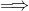 duplicates
  - **Problems**: This approach will only detect exact duplicates
  - **Goal**: Want hash functions that are tolerable of minor differences
    - if high similarity, then we want a high probability of collision

**MinHash**
- Documents (raw html) are represented as shingles
  - Write each webpage as a set of it's shingles
- Jacarrd can be written as
  - 
- Compute min hash
  - randomly permute the rows
    - Problem, this is expensive
  - The first row with 2 1's is the hash
  - Then Probability of collision 
- At scale
  - Interpret the has value of the shingles as a permutation
  - Keep track of the minimum hash that you've seen

#### Extract Similar Pairs
- **Task**: Discover all pairs with similarity greater than s
  - **False Positives**: There are going to be pairs that collide, but the probability is lower than s
    - Can throw away those with a low threshold
  - **False Negatives**: There are going to be pairs that don't collide, but the similarity is greater than s
    - No way to recover, if you haven't discovered, you haven't discovered.
  - Asymettry of cost

##### Locality Sensitive Hashing
- Compute min hash for each object
- group objects by their hash values
- Output all pairs within each group
- How to recover from false negatives?
  - **Compute multiple minhash values at once**
  1. Compute 2 minhash values and concat = signature
  2. Group object by their signature
  3. output all pairs in each group
  - If 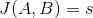, then probability we detect it is 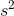
    - This is because both parts of the signature need to collide.
    - What this achieves is, reduces the probability of false positives colliding
    - **Trade-off**: Creates more false negatives: **All** Parts of the signatures have to collide

###### n different k Minhash signatures
- Do k Minhash, n times. Each time use a different k
- Algo
  1. For each object, compute n set k minhash values
  2. for each set, concat k minhash values together
  3. in each set: group objects by signatures, output all pairs in a group
  4. de-dup pairs
- 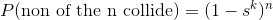
  - If none of them collide, then we don't collide.
- 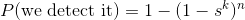
- **Moral of the story**: Minhash works great for finding object with high similarity, poor for low similarity
  - But for this application this is great!

###### Practical Notes
- Can generate M minhash values for each object, select k of them n times with replacement
- Determining authoritative versions
  - Which is the real one (i.e. which is the real wikipedia)
  - This algorithm doesn't solve this

##### Offline Extraction vs. Online Querying
- online: Given a new webpage, have I seen it before?
- Precompute values and store in a hash table in memory.

#### Limitations of Minhash
- good for near duplicates
- jaccard similarity only
  - No euclidean, cosine
- Set based, no way to assign weight to features

#### Random Projection
- Generate a random vector r of unit length
- Given a vector u, compute 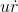, check if it is above or below 0.
  - Which side of the hyperplane is it on.
- 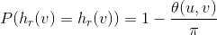
  - Only case of collision is if the vectors are on opposite sides of the hyper plane
  - If the vectors are farther apart (in terms of angle), then it's more likely that the hyperplane will split the vectors.

##### RP Signature
- Given D random vectors
- Convert each object into a D bit signature: $$u = \[h_{r_1}(u), h_{r_2}(u), \ldots, h_{r_D}(u)\]
  - Where does the vector fall with respect to all of the hyperplanes
- This vector is an addressing mechanism
- The angle between vectors can be expressed in terms of the hamming distance
  - If points are closer together, then fewer bits need to be changed, they are likely to fall within the same "Cell"

###### One-RP Signature
- Compute D-bit RP signature for every object
- Take the first bit, split objects into 2 sets
- Perform brute force pairwise hamming distance (on each side)
- In each bucket, retain those below hamming distance threshold.

###### k-RP Signature
- Take the first k bits, bucket objects into  sets
- But run into the same minhash problem, do the same solution

###### m sets of k-RP signatures
- Compute D bits for each object
- Choose m sets of k bits, for each set: use k selected bits to bucket objects into 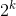 sets

**Online Querying**:
- Same as minhash
- Precompute the existing collection
- Store in-memory hash table

#### Additional Issues
- Emphasis on recall, not precision
- Sources of error
  - from LSH: stocastic element of not coliding
  - Using hamming distance as a proxy for cosine sim
    - hamming distance is cheap to compute (bit operations)
- Load imbalance
  - In reality, objects tend to clump together
  - All Objects could lie on one side of the projection
  - Then nodes could have a unbalanced amount of work to compute.
- parameter tuning
  - No way to know the right params to use for your application

##### Solve Load Imbalance: Sliding Window
- Compute D-bit RP signature for every object
- For each object, premute the bit signature m times
- For each permutation, sort bit signatures
  - Apply a sliding window of some constant size B
  - Partition based off of that window
