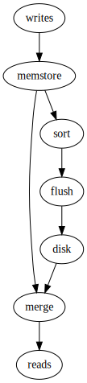

# Lecture 18 - March 13, 2018

## Mutable State

**Problem**: How to keep track of mutable state in a scalable manner?
- State is unlikely to fit into a single machine -> must be distributed
- MapReduce won't fix it, it's immutable

### What do Databases Provide
- relational models with schemas
- SQL queries
- ACID properties

#### Painpoints
- annoying to change the schema later on
- Some overhead for ACID properties
- Cost: Less so today, but used to be expensive
- Gives you everything at once, whether or not you need it

### JSON
- Flexible, no schemas, no types
- can arbitraily nest things
- Possible to get inconsistencies, incompatible types
- How to represent null?
- no

### RDBMS Features a la carte
- Some applications where consistency is given up for scalability
  - Shopping cart, may not always be there
- Give up relational model for flexibility

### NoSQL
- Used to mean strictly "No SQL"
- But now, "Not only SQL"
- focus on horizonal scalability
- replication
- weaker concurrency than ACID
- Efficient uses of distributed indexes and RAM
- flexible schema
- **Note**: MySQL probably works

#### Main Trade-offs of Design
1. Partitioning (sharding)
  - To increase scalability, decrease latency
  - many smaller partitions
  - **Key Problem**: How do you keep track of the partitions
2. Replication
  - To increase robustness (availability) and to increase throughput
  - **Problem**: Consistency, make sure that all replicas are kept in sync
3. Caching
  - To reduce latency
  - Move it up the storage heirarchy
  - **Problem**: Consistency, make sure that all replicas are kept in sync

### Key-Value stores
- Distributed hash tables, store associations between keys and values
- Keys typically primitive values, values can be primitives or complex objects
  - often times the values are just blobs of bytes

#### API
- `get`: fetch value associated with key
- `put`: Store key value pair

#### Consistency Model
- support for atomic puts, either succeeds or doesn't
- no support for cross-key operations: no transactions
  - i.e. terrible idea for banking

#### Implementation

##### Single Machine
- **Non-persistant**: Just a big in-memory hash table
  - Redis, Memcached
- **Persistent**: Wrapper around a traditional RDBMS
  - Linkedin Voldemort

##### Distributed
- partition solution (naiive)
  - hashed mod n (n = number of partitions)
  - adding a new machine -> need to re-hash everything
    - Requires moving keys and values to the right machine
  - What happens if a machine fails -> Rehashing
- Clever solution
  - hash the keys and the machines
  - Each machine holds a "pointer" to it's predessesor and successor
    - Think a doubly linked list
    - Can route on O(n) hops
  - Finger tables -> Skip pointers (+2, +4, ...)
    - Can route in O(log(n)) hops
  - In Practice: Service registry
    - Some centralized service
    - Machines connect with the service registry, tell it what ranges it's serving
    - Service can route directly to the machine
  - New Machine joins
    - Some range is split
    - No need to rehash **everything**
    - Localized to only the machines in the range
    - **But**: There's still a lot of data to shuffle around
  - Machine fails
    - Solution: Each nodes holds it's range, it's predessecor, and successor's
    - Overlapping archs
    - **Replication creates a consistency problem**: [see Next session](lecture19.md)
  - Virtual nodes
    - Don't directly hash servers
    - Create a large number of virtual nodes, assign virtual nodes to physical machines
    - When machine fails, load is more evenly distributed to the physical nodes
    - When a machine comes online, draw lots of data from smaller physical nodes.

### BigTable
- Google Project

#### Data Model
- Map indexed by a row key, column key and a timestamp
  - Map to a blob
  - Keys are sorted
- Supports lookups, inserts, and deletes
  - Single row transactions only
- Rows maintained in sorted lexicographic order
  - Apps can do row scans
  - Why urls are stored in inverted order
  - `com.cnn.www`: Then all pages from a particular domain are stored together
  - Rows are dynamically partitioned into tables
- Columns: Stored as families
  - 2 parts: `name:qualifier`
    1. Name
    2. qualifier
  - Columns families provide locality
  - unbounded number of colunms

#### Implementation
- In-memory
  - easy mutability
  - relatively low memory
- disk
  - hard mutability
  - big

Solution is to use **Log structured merge trees**
- **Memstore**: In-memory Key value store
- Eventually you run out of memory, sort the rows, flush to disk
  - Now reads have to go through a disk lookup and the in-memory, reconcile in-memory and disk
  - Immutable
  - Memstore takes priority
- Mutate values in memory, flush to disk when full, reconcile reads, update in memory

- **Issue:** Run out of memory multiple times?
  - Read path involves merging from multiple stores
  - Recall: Timestamp is a part of the key, want the most recent
- Compaction
  - Periodically, merge multiple stores together
  - resort keys
  - reconcile values
  - multi - level scheme
    - tree portion
- Write Ahead log
  - before mutation, write to the log
  - in the event of a failure, the node can replay events from the log to fix the state.

##### Distributed Version
- GFS: file system
- SSTable: Stores
  - Persistent order immutable map from keys to values
  - provides replication for free (as a result of being stored on GFS)
  - get operations, range queries
- Tablet: Range of rows in a table
  - Dynamically partitioned range of rows
  - Multiple SSTables
- Tablet Servers
  - The LSM structure on a particular node
- Chubby

A table is divided into ranges, ranges are multiple tablets

Tablet to Tablet Server Assignment
- Each table is assigned to one tablet server at a time
- exclusively handles read and write requests to that tablet
- What happens when tables grow to big?
  - Split a tablet into 2 smaller tablets
    - **This is how we can have SSTables that are shared between tablets**
  - dynamic partitioning
- What happens when a tablet server fails?
  - We have WAL
  - We have replication on GFS
- **need a central lock service**
  - zookeeper
  - When tablet servers are up, they register with the service and what range they are responsible for
  - The server will prevent any other servers from taking up that range
  - Helps manage the splitting
  -
- consistency?
  - HFiles are replicated on HDFS
  - Only 1 tablet server is responsible for a tablet
    - Guaranteed by the locking server
