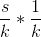

# Lecture 23 - March 29, 2018

This is the last lecture with real content.

## Real-Time Analytics 2
recall:
- Storm/Heron: computational graph,
  - verticies: Computations
  - edges: tuples transfered along
  - Problem: only the pipes
- Spark Streaming: everything is an RDD
  - chop up continuous datastream into small RDDs
  - use regular Spark operations
  - Problem: No distinction between event time and processing time
    - only when it arrived to spark, not when it was actually generated.
- Beam
  - gives you transformation and windowing
  - operations similar to Spark, but recognizes event time and processing time distinction
  - Problem: too complex, too many things to keep track of
    - watermark
    - whole results or deltas?
    - Ugly nested expressions

### Spark Structured Streaming
1. From RDDs to DataFrames
  - **Dataframes**: RDDs with schemas (think of them as tables)
  - why use Dfs? RDDs give you too much flexibility, limits how Spark can optimize.
  - sidenote: Spark SQL requires dataframes
    - in regular usage, you can convert an RDD to a df, provide a schema
2. From bounded to unbounded tables
  - data stream comes in, each data item is a row that's appended to the table

#### Programming Model
- Each query is simply relative to what the table looks like at that particular time
- Trigger: When you compute results
  - ex. trigger every second
- Output: Have a choice on how output is generated after a Trigger has run
  - Competed mode: Gives you the entire table, up to you to deal with it
  - Update mode: Only gives you the differences
  - Append mode: Only gives you the new rows

#### Event Time
- Create windowed aggregations explicitly over event time
  - Can handle the early event problem: Suppose 10 minute interval, computed every 5 minutes
    - the 12:10-12:20 interval will be computed at 12:15, with partial results
  - Late Arrivals?
    - Spark will see an event with an event time, and insert it into the correct location
- tag 1 part of the tuple as the event time, all windows are built around the event time

### Challenges of Graph and Stream Processing - Algorithmic Solutions
- recall challenges of latency and space requirements
- **Sampling**: Throw away samples
- **Approximations**: Can perform operations faster in order to gain efficiency (lower latency)
  - Various Hashing Processes

#### Reservoir Sampling
- Overcome high volume stream
- Select s elements from a stream of N elements with uniform probability
  - note that N can be very, very large, but unknown.
- Can't deal with the volume of the stream
- Alg
  1. Store the first s elements
  2. For each k-th element after, keep with probability of 
    - Randomly drop an existing element if you decide to keep
- Probability of an element being discarded: 
- Probability of survival:  -> 1 - prob of discarded

#### Hashing
- Problem: As you observe more examples, the data structures will grow in space
- Deal: If you can accept approximations, then the task can be solved with much lower space

##### Cardinality Estimation
- Exact: Use a HashSet
- Approx: Hyper LogLog Counter
- what is the cardinality of a set S?

###### HyperLogLog Counter
- `size()`: number of unique values in the set
- hash each element and examine the hash code
- Keep track of some pattern in the hash code, ex. The number of leading zero's
  - This is noisy, use multiple hash functions and do it lots of times

##### Set Membership
- Exact: Use a HashSet
- Approx: Bloom Filters
- If x a member of set S?

###### Bloom Filters
- keep track of set membership
- components
  - m-bit bit vector (note constant space)
  - k hash functions
- `put(x)`: Add x to the set
  - run x though each hash function,
  - set the corresponding bit in the bit vector to 1
- `contain(x):`Is x in the set?
  - Run x throuh each hash function, look at the corresponding values in the bit vector, and the results
  - Possiblities of false positives: You never inserted `x`, but contains returns true
    - This happens when the output collides on all values, such that AND returns 1
  - False negatives are impossible
- In practice: constraints
  - how much space do you want to allocate?
  - What probability of false positives do you want?
  - Tune the size of the Bloom Filter

##### Frequency Estimation
- Exact: Use a HashMap
- Approx: CMS
- How many times have we observed S?

###### CountMin Sketches
- components
  - m by k array (matrix) of counters
  - k hash functions
- `put(x)`: Increment the count of x by 1
  - run x through each hash, increment the cooresponding spot in the table
  - As collisions happen, possibility of overcounting
- `get(x)`: Return the frequency of x
  - run x though all of the hash functions
  - look up the cells
  - return the min count.
- why does this work?
  - collisions cause overcounting
  - as long as there's at least one row in which your not colliding the count will be correct
- Gives a reasonable estimation of heavy hitters
  - frequent over-estimation of tail, words that occur once (very long tail)
  - Recall Zipf and language
- Constraints
  - number of distinct events
  - dstribution of events
  - error bounds on the counts
  - tune the table size and the number of hash functions

### Real Time and batch at the same time
- hybrid system
- example: click counts
  - build a dashboard for advertisers
  - show historical clicks counts and real time clicks
  - Have a parallel infrastructure, called a lambda architecture
    - HDFS -> batch processing -> store the results somewhere
      - historical
    - Kafka -> online processing -> store the results somewhere
      - typically keep a moving window over the last day
  - The client app can query both and merge them together
    - if there's an overlap: you choose
    - Typically keep batch as they will typically be more accurate
  - But this is bad
    - Duplicate codebases, the same logic, and need to keep them is sync
      - Hadoop jobs and Storm jobs
    - Typically two different teams working with online and batch
    - operational issues in merging
      - sometimes batch jobs can fall behind
      - online version may not be storing enough
        - could be storing too much and wasting resouces

#### Summingbird
- integrate batch and online processing
- Write everything in the same language, generate the batch and online jobs

Ideas:
1. Structures to integrate batch and online processing
  - Recall: Semigroups, Monoids, and Commutative Monoids
  - summingbird must be at least semigroups: guarantees the power of associativity. Put paranthesis anywhere, results are the same
2. For many tasks, approximations are good enough
  - Formulate the hashing approximations as monoids
    - "Adding" two Bloom Filters is OR the bit vectors

#### Next Idea: Everything is Streaming!
- Idea: batch processing is just streaming through sometime you've already stored
- Everything is Kafka, but it looks like Spark
- Kappa architecture
- Bounded Dataset: A historic dataset
  - watermark is at the end of the computation
- Unbounded Dataset: Streaming
  - need windows, watermarks, early / late arrivals, etc

