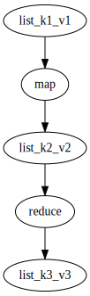
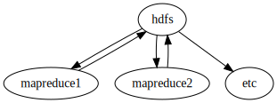
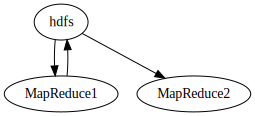

# Lecture 5 - January 18, 2018

## Debugging at Scale, Works on Small dataset, doesn't scale
- Memory management, **Don't buffer objects**
- Generating too much input data
- Mangled input records, real world data may not be clean.

## Recall the instrution set of the datacenter
So Far:
- `Map`
- `Reduce`

This can be thought of as "assembly opcodes" of the datacenter.

Need higher level languages for data processing
- Facebook, hive, Translated SQL to MapReduce jobs
- Yahoo, Pig scripts, "compiled" to MapReduce jobs

## PIG Scripting
- Generates a query plan from the script (load, group by, joins, aggregate, etc)
- It then generates a series of MapReduce jobs from the query params.

### Basics

#### Data

Sequences of statements manipulating aliases (variables)
- atoms
- tuples
- bags
- json

#### Operations

- LOAD: get from HDFS
- Filter: Throw away unwanted tuples
  - **Think Mapper**
- Group: Group tuples together
  - **Think Reducer**

#### User Defined Functions
- Write arbitrary functions in any language
- Express core functionality / computations in a UDF
- Take advantage of Pig as the glue to scale out.

## Datacenter is the computer
- Higher level languages fixes the annoyance of writing MapReduce jobs
- **Problem**: The compiler still only has Map and Reduce to work with.

### NAND gates analogy
- Can make any logical gate with NAND gates
- But it would be nice to have other means of expression

### Why is MapReduce designed the way it is?

#### Data Flow Language: Want Data parallelism as a core concept
We have a collection of records and want to apply a bunch of operations to compute some result

- Assumption: Static collection of records
  - Ignore Streaming data for now

##### Need Per-Record Processing
This is `Map`!
- Easy to parallelize
- Many implementation details (scheduling, concurrency)

##### Need to Store the intermediate results
This brings the need for some sort of addressing mechanism, and reconcile.

##### Reconciliation of intermediate data
Another computation, this is **Reduce**!

#### Data Pipeline
Abstracting away the data parallism

### MapReduce Workflows
Where do we need more then just Map and Reduce?

#### Chaining Jobs

##### Problem
We always have to go back to HDFS

##### Map-Map?

### Dryad Graph Operations: Enriching the Language
- Framework would take a data flow graph (written in some language) and executes it

#### Cool Tricks
- MapReduce must always go back to HDFS
- Dryad: more options, can adapt to the specific use case
  - Shared memory
  - TCP
  - File
- Runtime graph refinement
  - Input not known until it's read
  - Can dynamically spin up new instances to increase parallelism

**Downfall**: Painful to write

#### Answer: Add a higher level language!
- Microsoft: LINQ
- Very similar to the PIG solution, but has more operations at it's disposal
  - No need to context switch to some other language
  - More testable
  - Strongly typed

## Spark
- The answer to "What's beyond MapReduce"

### Resilient Distributed Dataset (RDD)
- Primitive operation in Spark

#### Get a bunch of Map-Like operators
- Map
- Filter
- flatMap
- mapPartitions
  - In MapReduce, you can control the lifecycle (`setup` and `cleanup`)
  - Basically, this was added afterwards to mimic the lifecycle

#### Reduce Like Operations
- groupByKey
- reduceByKey
- aggregateByKey

#### Sort Operations

#### Join Operations

## A1 Tips
- Need multiple MapReduce Jobs
- Sidedata: Output of one job feeds into the input of another.

