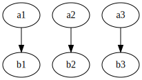
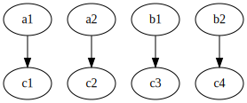
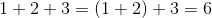

# Lecture 6 - January 23, 2018

## A0 Corner Case
Note the threshold: if you use the reducer as a combiner, then the thresholding will apply on the partial results (i.e. from each Mapper). **THIS IS WRONG**

Should use a separate combiner, which doesn't apply the threshold.

## Datacenter is the Computer

> Abstraction is another level of indirection

### Mapreduce
Recall: We only have two operations:
- Map
- Reduce

### Spark
Is just like this, but provides a richer instruction set for the datacenter computer.
- But is still fundementally operations on large lists of data

#### Word Count

```scala
val textFile = sc.textFile(args.input())

textFile
  .flatMap(line => tokenize(line))
  .map(word => (word, 1))
  .reduceByKey((x, y) => x + y)
  .saveAsTextFile(args.output())
```

#### What is an RDD?
**Resilient Distributed Dataset

- Partitioned: Distributed amoungst a bunch of nodes
- Immutable

##### A Spark job is a sequence of transformation on RDD's
- All transformations are lazy evaluated, produce another RDD.
  - Allows the framework to optimize the execution behind the scenes
    - Resiliency via the application of distinct deterministic transformations to other RDDs
    - Can reconstruct RDDs, even if it's only partially cached.
    - As long as everything starts from stable storage (HDFS), Spark can be rebuilt.
    - **Note**: Can't explicitly go back, some transformations loose information (i.e. `(x, y) => x + y` - what are x and y given the sum?)
  - Can specifically choose to materialize the RDD in some way
    - Store in a file
    - In Memory
- Transformations aren't evaluated until an action is specified.
  - Write to a file

#### Spark Execution
- Cores are **per executer**
- 4 Executers and 4 Cores -> 16 Threads

### Yarn - Yet Another Resource Negotiator
- Allows for allocation of clusters
- Framework is another layer of indirection
- Multiple clusters in parallel (Hadoop, Spark)
- "Scheduler of Schedulers"

#### Hadoop's original limitation
- Can only run MapReduce
- How can the cluster run another framework.
- Framework talks to YARN to create a MapReduce cluster, which can then run the job

#### Resource Manager
- Divides resources to various clients
- Containers to run whatever

## Spark Programs
- `spark-shell`: REPL
- `spark-submit`: Submit Jobs

### Local Threads vs. Spark Executor
- Spark Executor: Run things like Map, transformations
  - Runs on the actual worker
- Local Threads: Just a Scala program
  - Run actual code on the driver

**Note:** `.collect`: Bring an RDD to the local driver program from the worker
- If the RDD is too big then you'll run out of memory
- Typical way of using this:
  - Do a bunch of transformations (on the workers)
  - Build some working set
  - `.collect`
  - Do whatever you want locally.

### Input Formats
- Spark does the same thing as Hadoop behind the seens
- Same InputFormat

### Physical Operations
Quite similar to how MapReduce is implemented, just operations on RDDs







#### Spark Execution Plan
- Very similar to the PIG logical plan
- While Spark doesn't just "compile" to MapReduce jobs, it is a refinement / evolution.

##### Can't avoid shuffling, sorting
- Still need to communicate the partial results
- **Key Difference**: Spark is more eligent
  - MapReduce forces you to write it to HDFS
  - Spark allows you to pipeline the data to other transformations.

###### Implementation

Could take a Hash shuffle approach
- Hash to send to the proper location
- Note that there is no sorting here
- **Problem**: Not scalable!
  - Imagine 1,000 mappers and reducers

Sort Shuffle
- Almost exactly the same as distributed group by
- **Key difference**: Append only Map instead of a circular buffer
  - Keyed by the intermediate key

##### Where are the combiners in Spark?
- `reduceByKey (f: (V, V) => V)`
  - Spark can either execute this on the Map side or reduce side
  - Very rigid in it's form
  - Reducer is the combiner
  - **Implication**: In Mapper combining doesn't do anything
    - Spark never serializes the intermediate result to HDFS
    - Can aggregate when adding to the intermediate map.

- `aggregateByKey`

### Spark Wins
- Richer operations, more capabilities
- RDD abstraction optimizations
  - Preserve the resiliency
- Bindings in other programming languages
  - Scala, java, python, R
- Notebooks!

### Spark Downsides
- By default uses Java serialization (:shit:)
- Scala has poor support for primitives
  - I just want an `int` - 4 bytes, not an `Integer` object.

## Superpowers
- Associativity
- Commutativity
- (minor) Sorting

#### Associativity
- Put parentheses where ever you want
- 

#### Commutativity
- Perform operations in any order, still get the same result.

### Implications for Distributed Processing
- Lots of things going on behind the scenes
- **With these properties you don't need to care**

#### Word Count
- Simply takes advantage of associativity and commutativity to add up a bunch of 1's

#### SemiGroup
- A set and an operation on that set
- The operation must be associative

#### Monoid
- A semigroup + identity element
- example: 0 or 1

#### Commutative Monoid
- A monoid + commutativity

#### Example
- Set of ints, operation: Addition, identity: 0
- set of ints, operation: Multipication, identity: 1

### reduceByKey
- It takes in a Monoid!
- Takes in a set
- function is the operation

#### Co-occurrence matrix
- Monoid: Set of all possible associative arrays
- Identify: Empty associative array
- Operation: Element-wise addition

### aggregateByKey
- Basically takes the combiners, allows you to execute on the Map or Reduce side.
- `seqOp`: Combiner (executed on the Map side)
- `combOp`: Reducer (executed on the Reduce side)

### Sorting
- Formulate the problem in terms of monoids
- If you can't, use sorting to sequence your computations.


