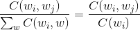
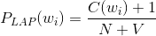
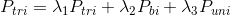
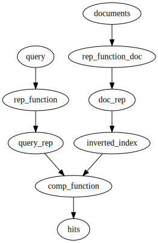
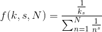

# Lecture 7 - January 25, 2018

## Course Structure
- Done with the core framework features and algorithm design

## Language Models

### Build them
- Train them on a large corpus of text

### How are they useful
- Extract meaning
- Prediction

### Chain Rule
- Note: Typical English sentence is about 20 words.
- Impossible to compute the true probability distribution

#### Use the Markov assumption
- Limit the history to a fixed number of words (N-1)

##### Unigrams
- Single words

##### Bigrams
- Past 2 words
- "Happy" -> "Birthday"

##### Trigrams
- Last 3 Words

#### Maximum Likelihood Estimation
- For unigrams: 
- Bigrams: 
  - Subully different, in the first case need a "end of sentence" marker `</s>`

### Smoothing
- Don't want zeros for the output
- Want to differentiate between different outputs, rank them by likelihood
- Allows us to work with words/data that we've never seen before.

#### Laplace
- simplest smoothing technique
- Just add 1 to all counts
  - What happens for the counts that we haven't seen?
  - "You've only seen half of everything you've seen"
- 

#### Jelinek-Mercer Smoothing: Interplation
- Mix higher-order with lower-order models to defeat sparsity
- Weighted sum of the lower order grams
- 
  - You would tune the 's to tune.

#### Kneser-Ney Smoothing
- Interpolate discounted model with a special "continuation" n-gram model
- appearance of n-grams in different contexts.
- State of the art

> I can't see with out my ???

- Most likely `glasses`
- A dumb model could pick "San Franisco"

#### Stupid Backoff
- "So stupid that we didn't think it would work, but it does"
- relative frequency, if you've seen it
- If not back off to the lower order relative frequency
- Example: Trigrams, don't see it? -> bigrams, don't see it? -> unigrams
- **Note:** This is not a probability distribution, it's just a score.

##### Stupid Backoff: Pairs

- straightforward: Count each order separately
- Smarter: Do it in one pass, sorting

###### Optimizations
- Replace strings with ints
  - Assign an id based on frequency, helps with compression
  - More frequent words get a smaller id.

- Load balancing: Don't want all of the words to go to a single reducer (i.e. `the`)
  - Partition based on bigrams
  - Sideload in the unigrams

### Trade-offs
- State of the art smoothing (small data) vs. stupid backoff and lots of data

## Statistical Machine Translation
- The best thing before Neural Networks came along.
- Find a modern Rossetta Stone.
- Goal: translate a foreign language into English.
  - Tiling problem: Select the tiles (find a path) that create the most likely English sentence.
  - Use the language model for this!

### Noisy Channel Model
- Take english through some noisy channel and produce french
- Try to reconstruct the english
- Use the language model to pick the most likely sentence

> It's hard to recognize speech
> It's hard to wreck a nice beach

This is what autocorrect uses
- why fails? it typically fails on unique, infrequent instances
- Will likely select a frequent, but nonsense, phrase.

### Neural Networks
- Now the state of the art
- But, still powered by data!

## Search

### Information Retrieval (IR)
Mostly focussing on text

#### Central Problem
The terms may not match up

- Search: Wants to find something
  - Has some concepts that they want to find
  - produces query terms
- Document Author: Created a document
  - Has some concepts
  - translates them into a set of terms that form some document

### Bag of Words Model
- Throw away the structure of a sentence
- Count the words
- Assume term occurrence is independent (basically a unigram model)
- Document relevance is independent
  - Not true in the real world
- Define what a word is

###### Makes information retrieval a counting problem

### Indexing: Performance Analysis
- MapReduce shuffle and sort
- Load in a portion, sort it, dump it to disk
- Go over all the parts and do a merge pass

#### Heap's Law: Vocab size

- Vocabulary size is an unbounded problem.

#### Zipf's Law: Postings Size

- Few words occur very frequently
- Long tail of very infrequent words.

#### MapReduce: Index Construction
- Map over all documents
  - Tokenize, case fold, stop words, stem
  - emit term as key, (doc_id, term frequency)
  - Potentially emit term position
- Sort/shuffle: Groups postings by term
- Reducer
  - Gather and sort the postings (typically by doc_id)
  - Write the postings to disk
  - **Problem**: How to sort without buffering?
    - This won't scale!
    - Next class.....
