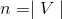
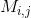
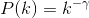
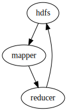

# Lecture 9 - February 1, 2018 - 4a Analyzing Graphs

## Analyzing Graphs
- Set of verticies / nodes
- set of edges
- graphs are everywhere

### Sparse Graphs
- Much fewer edges than verticies
- These are the type that we care about processing

### What makes graphs hard?

- irregular structure
  - Many approaches to data structures
- irregular data access patterns
  - Not accessing sequential regions of memory
- Iterative algorithms
  - Lots of ways to optimize

### Graphs in MapReduce (and Spark)
- want to process the entire graph
- run local computations in each node and it's neighbours
  - have some metadata on the node / incoming / outgoing edges
- Propogate the partial results onto the neighbours
  - traverse the graph
- Based on the results you recieve, you do something else.

#### How do you represent graph data?
- Adjacency matricies
- adjacency list
-

##### Adjacency matricies
- $$n x n$ matrix M
- 
- Put a 1 in  if there is an edge from i -> j

###### Advantages
- Easy to describe with linear algebra
- Intuitivly iterate over rows and columns
  - helps with incoming and outgoing edges
  - Outgoing: look at rows
  - Incoming: Look at columns

###### Disadvantage
- Bad memory usage for sparse graphs

##### Adjacency List
- Like the matrix, but throw away all of the 0's
- Write the outgoing edges
- **Exactly the same data structure as a postings list for an inverted index**
  - All of the compression tricks apply here
  - delta encoding
  - vbyte

###### Advantages
- Much more compact
- Easy to compute over outlinks: Just look at the list

###### Disadvantage
- Harder to express computations over the incoming edges

##### Edge Lists
- Explicity enumerate all of the edges
- tuples

###### Advantages
- Can easily insert new edges
  - i.e. good for streaming

###### Disadvantage
- Wastes space

#### Partitioning Graphs

##### Vertex Partitioning
- Slice up the rows
- on the outgoing edges
- Some verticies, all of the incident edges

##### Edge Partitioning
We will have cases where we can't represent / process the graph on 1 machine

- Slice up the columns, incoming
- Some edges, all of the verticies

#### Storing Undirected Graphs
1. Store both edges
  - Need to de-dup
2. Store one edge
  - I.e. `x <-> y`, only output wrt x
  - Need to handle the opposite case.

#### Basic Graph Manipulations
- Invert the graph
  - flip the directions of the edges
  - `flatMap` and `regroup`
- Convert from an adjacency list to edge list
  - `flatMap` over the lists and output tuples
- Convert from Edge lists to adjacency List
  - Imagine a streaming scenario.
  - `groupBy`

#### Graph Visualizations
- Very large graphs become abstract, hard to understand
- Co-occurence matrix
  - Spectral relevance to cluster things together
  - Move the rows around
- Force Directed Graph layout
  - Imagine verticies are connected by strings (representing the edge weights)
  - verticies like to push themselves apart
  - physical simulation, see how it stabalizes

##### Limitations
- No idea how to visualize very large graphs (10,000+ verticies)

##### Broder's Bowie
- Middle part, strongly connected
- Left part: Part of the web that connects to the strongly connected component, by few edges back
- Right part: Part of the web that connects from the strongly connected component that doesn't connect back.

##### Degree Model
- proportion of connections
- Power law distribution (Zipf!)

###### Preferential attachment
- Rich get richer
- I'm going to add a new edge to the graph, likely going to connect it to one that has the highest degree.

##### How do we extract the webgraph
- URLs take alot of space
- Use monotone minimal prefect hashing
- Convert URLs to ints, store the hash map elsewhere
- Sort the urls, utilize prefix encoding (all URLs from the same domain are sorted together)
- Use integer compression techniques to compact.

## How do you traverse the graph?

### Single Source Shortest Path
- Find the shortest path from a source node to some target node
- Lowest edge weight / cost path

#### Single Machine
- Dijkstra
- Expand the frontier from the source node
- Expand vertex with the current lowest weight.

#### Distributed: Parallel BFS

##### Simplify: Assume the edge weights are 1
- For all nodes on the adjacency list: `distance_to(p) = 1`
- Expand recursively: `distance_to(n) = 1 + min(distance_to(m) forall m)`
  - Go through the list

###### Mapper
- A node knows it's d steps away from s, neighbours are d+1
- Map over the adjacency list
  - `emit(m, d+1)`
  - emit distance to yourself (which is just d)

###### Group By
- Group distances by reachable nodes

###### Reducer
- selects minimum distance path for each reachable node

###### Need to Run Multiple iterations (i.e Jobs)
- Each job advances the frontier by 1
- Problem: We loose the graph structure!
  - ugly Solution: Mappers need to also emit the adjacency list
  - Reducer assembles the graph structure and has the min

###### Stopping Criterion
- Number of iterations: The length of the longest path from the source (diameter)
- 6 degrees of separation
  - This gives us the average distance between any 2 nodes
  - Means that the number of iterations will be relatively close to 6 (less if your Facebook / Twitter)
- MapReduce:
  - Perform a convergence check outside of MapReduce / Spark
  - Use counters to check for convergence.

##### Comparision to Dijkstra
- Dijkstra more efficient
  - Better expansion of the fontier
- MapReduce explores all paths in parallel
  - Can only do work at the fontier
  - high cost to communicate the graph structure
  - **Why can't we do better**
    - Requires global state to communicate expanding the frontier by a specific node.

#### Single Source: Weighted Edges
- **Need Positively Weighted Edges**
  - Otherwise infinte cycles are possible

##### Mapper
- Instead of emitting `(m, d+1)` output `(m, d + w_m)`
- Use the actual edge weight

##### Stopping Criteria
- No guarantee that there isn't a path beyond the frontier that yields a shorter path.
- Just because we've found a node, doesn't mean we have the shortest path.

##### Iterations
- Worst case: You may need as many iterations as there are edges
- Practical: Keep running until the distances no longer change
  - Count the number that change.
