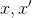
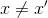

# Lecture 14 - June 18, 2018

## Public Key Encryption

### Key Exchange

Alice and Bob need to exchange a secret key in order communicate.

Use public key crypto to share a shared secret (session key), then use a symettric scheme (AES)
- RSA requires large keys (2048+ bit) to be secure, slow, expensive.
- AES 128-ish bit keys are sufficient, much faster
- **Hybrid Cryptography**

### Properties of secure hash functions
- Preimage resistance: Given H(x), infeasible to find x
- Second Preimage resistance: Given , infeasible to find x' s.t  and 
- Collision resistant: It is infeasible to find  st.  and 
